<center>Ubuntu使用笔记</center>
### 一、Ubuntu基础使用

#### 1.1 普通X86架构下平台安装系统

安装之前确认电脑的BIOS使用的模式，推荐使用UEFI模式，可在电脑BIOS中设置。***并且在BIOS中关闭安全启动，否则会导致Ubuntu系统下一些错误。***


软件[rufus](<http://rufus.ie/>)

系统[Ubuntu16.04](<https://www.ubuntu.com/download/alternative-downloads>)

系统[Ubuntu18.04](<https://www.ubuntu.com/download/alternative-downloads>)

需要注意安装的磁盘格式是MBR还是GPT，可以在我的电脑-管理-磁盘管理中查看。一般情况下固态硬盘用的都是GPT格式，使用UEFI模式的情况下推荐使用GPT。


##### 1.1.1 只安装Ubuntu系统

使用制作的启动盘，设置电脑从U盘启动，就可以直接进入到安装界面（或者选择安装和适用界面），直接使用推荐安装方式安装即可，不需要各种分区复杂操作。


##### 1.1.2 安装Windows和Ubuntu双系统

需要在Windows下留出大于20G的空间，并且删除分区使其处于可被其他系统操作的状态。

使用制作的启动盘，设置电脑从U盘启动，就可以直接进入到安装界面（或者选择安装和适用界面），选择和Windows共存的方式安装即可，不需要分区，如果需要，一般分区如下：

| 分区 |  EFI  | /boot |     swap     |    /     |
| :--: | :---: | :---: | :----------: | :------: |
| 大小 | 500MB | 500MB | 物理内存两倍 | 其余空间 |


#### 1.2 NUC平台安装系统

***安装系统之前必须关闭BIOS的安全启动设置，不然会无法安装一些设备的驱动，报错类似：***

```shell
modprobe error could not insert 'pcan' required key not available
```


系统的镜像文件[下载地址](https://ubuntu.com/download/iot/intel-nuc-desktop)，安装的步骤也在该网站有介绍，切记要升级BIOS，设置BIOS为UEFI，使用软件[rufus](<http://rufus.ie/>)制作启动盘。


#### 1.3 Xavier平台安装系统

设备线材：一台装有Ubuntu16或者18的主机，一条USB3.0的Type-c的线，Xavier。

1. 在主机上前往[英伟达官网]( https://developer.nvidia.com/embedded/jetpack )下载用于Xavier刷机的` NVIDIA SDK Manager `。
   注意：需要注册英伟达的开发人员账户才能下载，下载后是一个deb的安装文件，安装方式如下：

   ```shell
   sudo apt install *.deb # 两种安装方式选择其一
   sudo dpkg -i *.deb # 两种安装方式选择其一
   ```

   

2. 使用USB3.0的Type-c的线连接Xavier和主机。
   注意：连接之后确保被主机识别，为确保被识别的成功率，建议Xavier关机的状态下和主机连接，并且在主机上可以看到连接成功后有提示。

3. 打开` NVIDIA SDK Manager `软件：

   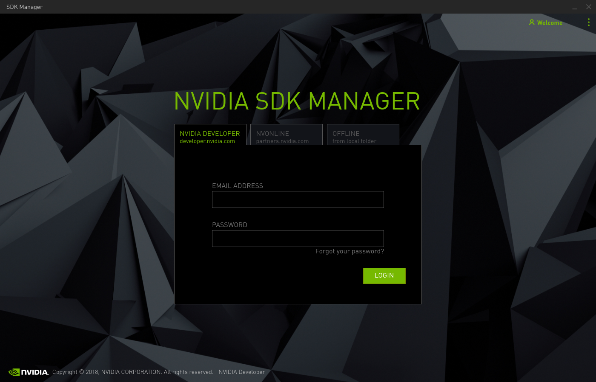

   输入账号密码登录。


4. 登录之后自动进入资源下载界面，如下：

   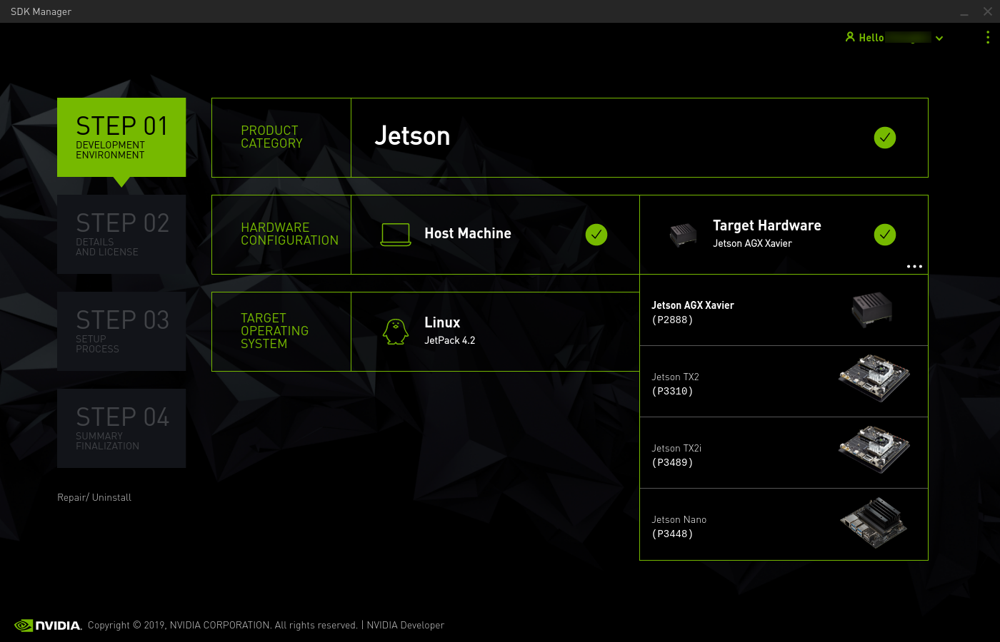
   
   注意到的是：**不要选择`Host Machine`，这个是为主机下载安装文件的，如果要安装主机的英伟达软件，可以通过这个实现，但不建议！！选择xavier的资源，进入下一步**


5. 配置好下载路径和一些资源之后，进入到刷机界面，选择自动模式，输入用户和密码即可（手动模式不推荐，如果系统损坏，使用手动模式，上网搜索教程即可或者查看手册）。
   
   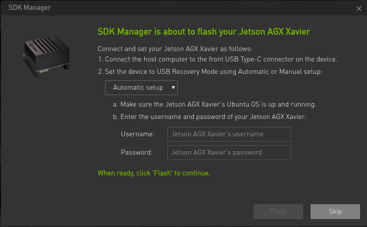
   
   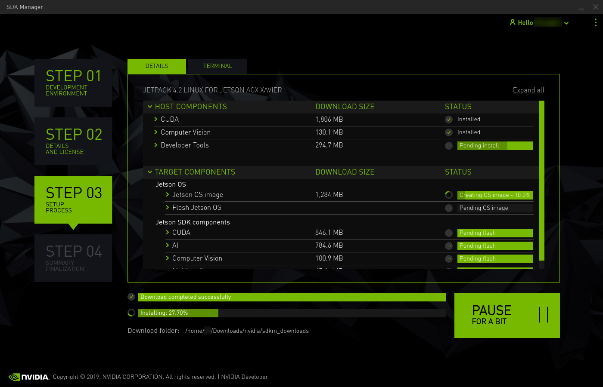


6. **重点步骤，直接关系安装成功和安装快慢！！！**
   前五个步骤执行之后，` NVIDIA SDK Manager `软件会首先为Xavier安装系统，安装系统之后，Xavier会重启一次，需要设置用户名、密码和地区等等，然后进入系统，这个时候则需要执行如下操作：
   ***暂停刷机，但不要断开Xavier和主机的连接！！***
   更改Xavier的源，具体操作为在Xavier中打开终端执行命令：

   ```shell
   sudo cp /etc/apt/sources.list /etc/apt/sources.list.backup
   sudo gedit /etc/apt/sources.list
   ```

   删除所有内容后，添加如下内容：

   ```shell
   deb http://mirrors.tuna.tsinghua.edu.cn/ubuntu-ports/ bionic-updates main restricted universe multiverse
   deb-src http://mirrors.tuna.tsinghua.edu.cn/ubuntu-ports/ bionic-updates main restricted universe multiverse
   deb http://mirrors.tuna.tsinghua.edu.cn/ubuntu-ports/ bionic-security main restricted universe multiverse
   deb-src http://mirrors.tuna.tsinghua.edu.cn/ubuntu-ports/ bionic-security main restricted universe multiverse
   deb http://mirrors.tuna.tsinghua.edu.cn/ubuntu-ports/ bionic-backports main restricted universe multiverse
   deb-src http://mirrors.tuna.tsinghua.edu.cn/ubuntu-ports/ bionic-backports main restricted universe multiverse
   deb http://mirrors.tuna.tsinghua.edu.cn/ubuntu-ports/ bionic main universe restricted
   deb-src http://mirrors.tuna.tsinghua.edu.cn/ubuntu-ports/ bionic main universe restricted
   ```

   之后再Xavier终端中执行命令：

   ```shell
   sudo apt update
   sudo apt upgrade
   ```

   执行完成后，再在` NVIDIA SDK Manager `中继续刷机，直到刷机结束。
   ***这一步的重点在于刷cuda等软件的时候需要联网安装一些文件，如果不换源则是连接国外服务器，速度奇慢，会导致刷机失败。***


#### 1.4 换源

Xavier的换源在1.3中已经说明，这里说明在其他平台上的换源方式：

Ubuntu 16.04：进入设置->Software&Update，选择源为国内源，推荐清华或者中科大。

Ubuntu 18.04：进入dash，搜索Software&Update，选择源为国内源，推荐清华或者中科大。


#### 1.5 快捷键设置

##### 1.3.1 截屏录屏快捷键

<a href="#3.16 截屏录屏">参考3.16</a>


##### 1.5.2 主文件（类似我的电脑）快捷键

图的打开为：`System Settings...` -> `keyboard` -> `Shortcuts`

见图中`Launch folder`

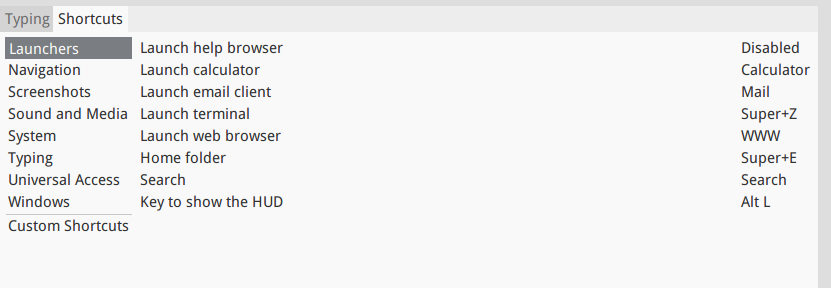


##### 1.5.3 终端快捷键

见上图中`Launch termial`


##### 1.5.4 显示桌面的快捷键

见图中`Hide all normal windows`

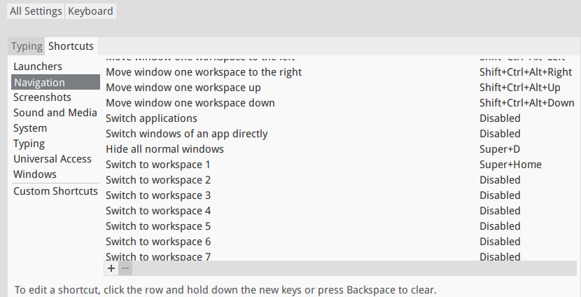


#### 1.6 挂载硬盘U盘

使用命令查看系统存在哪些分区：

```shell
cat /proc/partitions
```

可以根据显示的内容确定需要挂载的硬盘或U盘的分区，比如`/dev/sda` `/dev/sdc`等等，以`/dev/sdc`为例，挂载U盘（硬盘也是一样的操作），首先在`/mnt`目录（任意，推荐使用这个目录）下创建文件夹：

```shell
cd /mnt
sudo mkdir usb
sudo mount /dev/sdc /mnt/usb
```

之后进入文件夹下就可以看到内容了：

```shell
cd /mnt/usb
ls
```


#### 1.7 "歪门邪道"

##### 1.7.1 使用自定义命令行

可以在~/.bashrc中添加如下代码，创建快捷方式cw,cs,cm。分别执行' command'中的命令

```bash
#ROS alais command
alias cw='cd ~/Travel_Assistance_Robot'
alias cs='cd ~/Travel_Assistance_Robot/src'
alias cm='cd ~/Travel_Assistance_Robot && catkin_make'
```


#### 1.8 新建用户

具体步骤可参考[博客]( https://blog.csdn.net/brazy/article/details/82792571 )

1. 在vision用户下切换root用户，获取创建用户的权限：

   ```shell
   sudo su
   ```

2. 添加新用户，比如用户名为tracking：

   ```shell
   adduser tracking
   ```

   在命令行的提示输入中输入对应的Full Name即可，其他四项直接跳过。

3. 进入新用户tracking，之后赋予root权限：

   ```shell
   su root
   sudo gedit /etc/sudoers
   ```

   在` root ALL=(ALL:ALL) ALL `下面添加：

   ```shell
   tracking	ALL=(ALL:ALL) ALL # tracking和ALL之间是Tab，不是空格。
   ```

   退出之后即可。


#### 1.9 开机启动脚本

新建`_PWD_TEMP_`可执行sh文件：

```shell
gedit ~/_PWD_TEMP_
```

内容如下：

```bash
#! /bin/bash
echo "vision"  # vision替换为具体密码
```

赋予权限：

```shell
chmod a+x _PWD_TEMP_
```


新建开机自启脚本：

```shell
gedit ~/init_open.sh
```

内容如下：

```bash
#!/bin/bash

export SUDO_ASKPASS=./_PWD_TEMP_
sudo -A ./jetson_clocks.sh # xavier的风扇开机自启
./enable_can.sh # xavier的GPIO上can的开机自启
./pcan_install.sh # pcan的开机自启动配置
```

添加权限：

```shell
chmod a+x ~/init_open.sh
```

在命令行输入 gnome-session-properties 或者直接在dash中搜索Startup Applications，可以打开开机自启的配置，添加init_open.sh为开机自启脚本即可。


### 二、系统一些设置

#### 2.1 时间设置

修改Ubuntu系统时间与Windows时间不一致命令：

```shell
sudo apt-get install ntpdate
sudo ntpdate time.windows.com
sudo hwclock --localtime --systohc
sudo timedatectl set-local-rtc 1
```

***不建议使用命令修改时间，否则在Ubuntu系统下移植代码的时候编译报错时间相关的错误~***


#### 2.2 启动顺序设置

修改Windows和Ubuntu的启动顺序：

```shell
sudo gedit /etc/default/grub
sudo update-grub
```

注意的是从0开始计数~


#### 2.3 USB启动权限设置

插上USB设备

```shell
dmesg | grep ttyS*   #查看所有设备
lsusb  #查看所有USB设备，记住要修改的USB口设备号
ls -al /dev/ttyUSB0  #查看USB0的权限
lsusb -vvv   #查看USB 设备的 vendorID 和 productID
sudo gedit /etc/udev/rules.d/50-myusb.rules
```

在文件中写入

```shell
SUBSYSTEMS=="usb", ATTRS{idVendor}=="067b", ATTRS{idProduct}=="2303", GROUP="users", MODE="0666"
```

其中067b和2303用实际vendorID 和 productID代替。

***拔掉USB口***

```shell
sudo udevadm control --reload
```

***为了更好，甚至可以重启电脑***


#### 2.4 任务栏显示网速

```shell
sudo add-apt-repository ppa:nilarimogard/webupd8
sudo apt-get update
sudo apt-get install indicator-netspeed
```


#### 2.5 ppa操作

PPA 的一般形式是： `ppa:user/ppa-name`

##### 2.5.1 添加ppa

添加 PPA 源的命令为：

```shell
sudo add-apt-repository ppa:user/ppa-name
```

添加好记得要更新一下： 

```shell
sudo apt-get update
```

##### 2.5.2 删除 PPA 源 

删除 PPA 源的命令格式则为：

```shell
sudo add-apt-repository -r ppa:user/ppa-name 
```

然后进入 `/etc/apt/sources.list.d `目录，将相应 ppa 源的保存文件删除。 

最后同样更新一下：

```shell
sudo apt-get update
```


#### 2.6 文件夹操作

删除文件文件夹：

rm [选项] 文件

```shell
-f, --force    #强力删除，不要求确认
-i             #每删除一个文件或进入一个子目录都要求确认
-I             #在删除超过三个文件或者递归删除前要求确认
-r, -R         #递归删除子目录
-d, --dir      #删除空目录
-v, --verbose  #显示删除结果
```

常用如下几个：

```shell
rm -d 目录名    #删除一个空目录
rmdir 目录名    #删除一个空目录
rm -r 目录名    #删除一个非空目录
rm 文件名       #删除文件
```

在终端进到那个文件夹，然后执行：

```shell
sudo rm -rf 文件夹名
```

如果还是不行，就用

```shell
sudo chmod 777 文件夹名
sudo rm -rf 文件夹名
```


#### 2.7 Ubuntu的超级终端

`ctrl+alt+F2`开启超级终端，做修改后，`ctrl+alt+F7`回到图形界面


#### 2.8 远程控制

##### 2.8.1 Windows无图形界面控制Ubuntu

打开`cmd`/`powershell`/`cmder`

输入：`nvidia@IP`   （名字@IP）

##### 2.8.2 图形化显示界面操作

使用`TightVNC`软件


#### 2.9 Ubuntu16.04开启启动键盘的数字小键盘

```shell
sudo apt-get install numlockx
sudo gedit /usr/share/lightdm/lightdm.conf.d/50-unity-greeter.conf
```

在打开的文件中添加：

```shell
greeter-setup-script=/usr/bin/numlockx on
```


#### 2.10 编程字体设置

参考3.6安装字体之后，在所有编程软件中设置字体为需要的编程字体，推荐分先后：

1. InconsolataGO Bold (Vs code 中使用效果最佳)
2. Monaco (Qt等IDE中使用效果最佳)
3. InconsolataGO (可在gedit中使用)


#### 2.11 Ubuntu美化

##### 2.11.1 主题设置软件

```shell
sudo apt install unity-tweak-tool  # ubuntu 16.04
sudo apt install gnome-tweak-tool  # ubuntu 18.04
```


##### 2.11.2 主题**flatabulous-theme**

```shell
sudo add-apt-repository ppa:noobslab/themes
sudo apt-get update
sudo apt-get install flat-remix-themes
```


##### 2.11.3 主题图标**numix-gtk-theme numix-icon-theme-circle** (推荐)

```shell
sudo add-apt-repository ppa:numix/ppa
sudo apt-get update
sudo apt-get install numix-gtk-theme numix-icon-theme-circle
```


##### 2.11.4 Ubuntu18.04的几个主题图标

1. 主题[Vimix-Gtk-Theme](https://www.gnome-look.org/p/1013698/)

下载后解压到`/usr/share/themes/`，重启`Tweaks`在`Apperance -> Themes -> Applications`选择主题。


2. 光标[Bibata](https://www.gnome-look.org/p/1197198/)

下载后解压到`/usr/share/icons/`，重启`Tweaks`在`Apperance -> Themes -> Cursor`选择图标。


3. shell

```shell
sudo apt install gnome-shell-extensions
```

重启`Tweaks`，然后在`Tweaks->Extensions`中将`User themes`打开，重启`tweacks`在`Apperance -> Themes -> Shell`选择，使用`Vimix`主题。


4. 合并Top bar & Dock

```shell
sudo apt install gnome-shell-extension-dash-to-panel
```

效果如下：


5. 一些扩展

去Ubuntu应用商店下载安装：

NetSpeed      监控并显示实时网速。

Coverflow Alt-Tab    优化`Alt-Tab`，帅!

No Topleft Hot Corner     左上角hot corner 禁用


##### 2.11.5 图标**paper-icon-theme**

```shell
sudo add-apt-repository ppa:snwh/pulp
sudo apt-get update
sudo apt-get install paper-icon-theme
```


##### 2.11.6 Ubuntu18.04主题完整配置

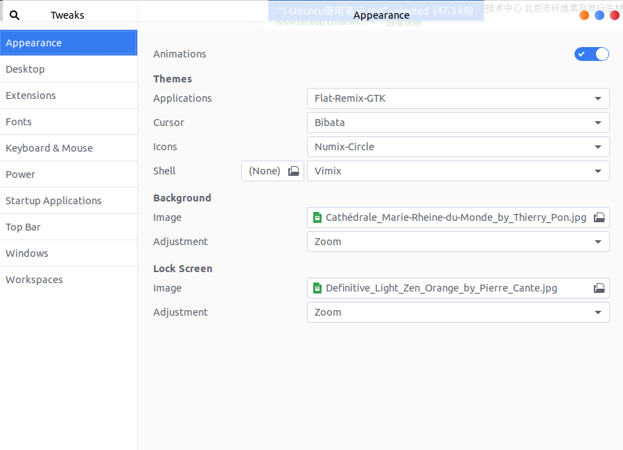


##### 2.11.7 字体

```shell
sudo apt-get install fonts-wqy-microhei
```

配置如下图：

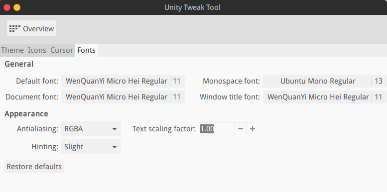


##### 2.11.8 **系统负载指示器**

```shell
sudo apt-get install -y indicator-multiload
```


##### 2.11.9 **经典菜单指示器**

```shell
sudo apt-add-repository ppa:diesch/testing
sudo apt-get update
sudo apt-get install classicmenu-indicator
```


##### 2.11.10 终端配置

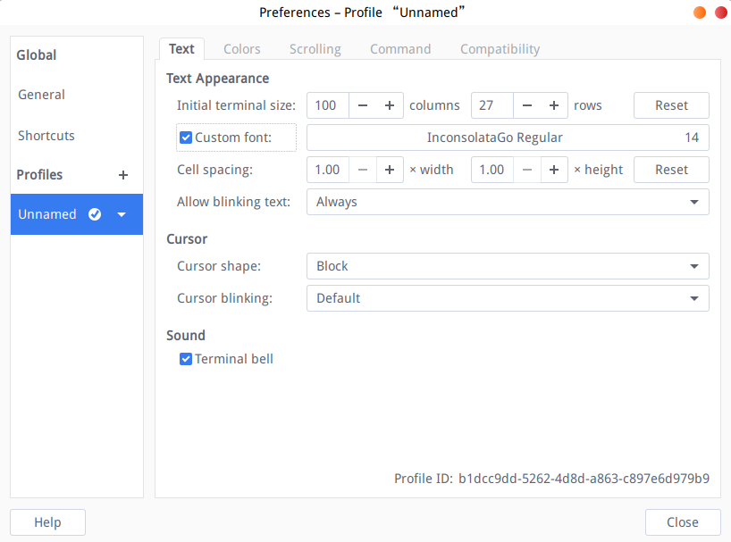

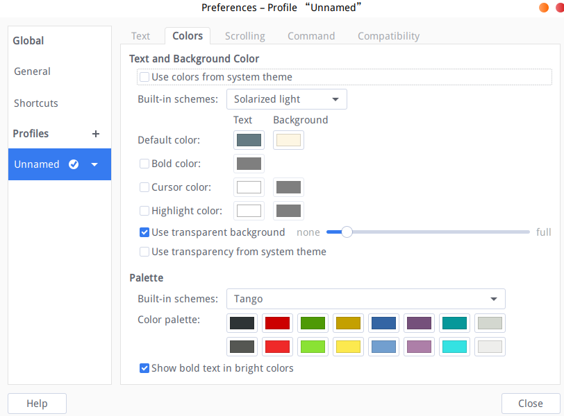


#### 2.12 默认终端的设置

安装dconf-tools

```shell
sudo apt install dconf-tools
```

依次打开org > gnome > desktop > applications > terminal


设置为默认的终端：

```shell
exec gnome-terminal
exec-arg -x
```


设置为Terminator

```shell
exec x-terminal-emulator
exec-arg -e
```


#### 2.13 网络掉线的原因

网络日常两三分钟就掉线，可以尝试

```shell
sudo gedit /etc/ppp/options
```

然后找到如下的数值设置为15

```shell
lcp-echo-failure 15
```

重启网络。


### 三、软件安装使用

#### 3.1 浏览器

##### 3.1.1 火狐浏览器

①卸载自带的火狐浏览器

```shell
sudo apt-get purge firefox firefox-locale-en firefox-locale-zh-hans
```

②安装火狐浏览器

下载地址在[firefox](<http://www.firefox.com.cn/>)；

解压放在合适路径，直接点击可执行文件即可运行；

制作桌面图标：

```shell
cd ~/.local/share/applications
gedit firefox.desktop
```

加入内容(对应修改)：

```shell
[Desktop Entry]
Type=Application
Exec=/home/vision/firefox/firefox
Icon=/home/vision/firefox/browser/chrome/icons/default/default128.png
Name=firefox     
Name[zh_CN]=火狐浏览器
Comment=火狐浏览器
GenericName=The browser named firefox.
Terminal=false
Type=Application
Categories=Development;Browser;Web;
```


#### 3.2 文件对比软件

##### 3.2.1 meld

```shell
sudo apt install meld
```


##### 3.2.2 beyond compare

[官网](http://www.beyondcompare.cc/)下载deb包安装

Linux下破解方法：

```shell
cd /usr/lib/beyondcompare/
sudo sed -i "s/keexjEP3t4Mue23hrnuPtY4TdcsqNiJL-5174TsUdLmJSIXKfG2NGPwBL6vnRPddT7tH29qpkneX63DO9ECSPE9rzY1zhThHERg8lHM9IBFT+rVuiY823aQJuqzxCKIE1bcDqM4wgW01FH6oCBP1G4ub01xmb4BGSUG6ZrjxWHJyNLyIlGvOhoY2HAYzEtzYGwxFZn2JZ66o4RONkXjX0DF9EzsdUef3UAS+JQ+fCYReLawdjEe6tXCv88GKaaPKWxCeaUL9PejICQgRQOLGOZtZQkLgAelrOtehxz5ANOOqCaJgy2mJLQVLM5SJ9Dli909c5ybvEhVmIC0dc9dWH+/N9KmiLVlKMU7RJqnE+WXEEPI1SgglmfmLc1yVH7dqBb9ehOoKG9UE+HAE1YvH1XX2XVGeEqYUY-Tsk7YBTz0WpSpoYyPgx6Iki5KLtQ5G-aKP9eysnkuOAkrvHU8bLbGtZteGwJarev03PhfCioJL4OSqsmQGEvDbHFEbNl1qJtdwEriR+VNZts9vNNLk7UGfeNwIiqpxjk4Mn09nmSd8FhM4ifvcaIbNCRoMPGl6KU12iseSe+w+1kFsLhX+OhQM8WXcWV10cGqBzQE9OqOLUcg9n0krrR3KrohstS9smTwEx9olyLYppvC0p5i7dAx2deWvM1ZxKNs0BvcXGukR+/g" BCompare
```

此时BCompare文件已经被破解，打开软件会提示"Trial Mode Error"，然后点击输入秘钥按键，输入如下秘钥即可注册成功：

```shell
--- BEGIN LICENSE KEY ---
GXN1eh9FbDiX1ACdd7XKMV7hL7x0ClBJLUJ-zFfKofjaj2yxE53xauIfkqZ8FoLpcZ0Ux6McTyNmODDSvSIHLYhg1QkTxjCeSCk6ARz0ABJcnUmd3dZYJNWFyJun14rmGByRnVPL49QH+Rs0kjRGKCB-cb8IT4Gf0Ue9WMQ1A6t31MO9jmjoYUeoUmbeAQSofvuK8GN1rLRv7WXfUJ0uyvYlGLqzq1ZoJAJDyo0Kdr4ThF-IXcv2cxVyWVW1SaMq8GFosDEGThnY7C-SgNXW30jqAOgiRjKKRX9RuNeDMFqgP2cuf0NMvyMrMScnM1ZyiAaJJtzbxqN5hZOMClUTE+++
--- END LICENSE KEY -----
```

成功之后在目录~/.config/bcompare/下会生成文件BC4Key.txt 如下：

```shell
Beyond Compare 4
Licensed to:    pwelyn
Quantity:       9999 users
Serial number:  9571-9981
License type:   Pro Edition for Windows/Linux/OS X

--- BEGIN LICENSE KEY ---
GXN1eh9FbDiX1ACdd7XKMV7hL7x0ClBJLUJ-zFfKofjaj2yxE53xauIfk
qZ8FoLpcZ0Ux6McTyNmODDSvSIHLYhg1QkTxjCeSCk6ARz0ABJcnUmd3d
ZYJNWFyJun14rmGByRnVPL49QH+Rs0kjRGKCB-cb8IT4Gf0Ue9WMQ1A6t
31MO9jmjoYUeoUmbeAQSofvuK8GN1rLRv7WXfUJ0uyvYlGLqzq1ZoJAJD
yo0Kdr4ThF-IXcv2cxVyWVW1SaMq8GFosDEGThnY7C-SgNXW30jqAOgiR
jKKRX9RuNeDMFqgP2cuf0NMvyMrMScnM1ZyiAaJJtzbxqN5hZOMClUTE+
--- END LICENSE KEY -----
```

如果要为所有用户注册BCompare，则执行命令：

```shell
sudo cp ~/.config/bcompare/BC4Key.txt /etc/
```


#### 3.3 OpenCV

不建议直接sudo apt install libopencv-dev，这样会安装较低版本的OpenCV，就安逸直接源码编译安装OpenCV3.4或其他更高版本。

[官网](https://opencv.org/releases/)下载

##### 3.3.1 安装前补足依赖

```shell
sudo apt-get install build-essential
sudo apt-get install cmake git libgtk2.0-dev pkg-config libavcodec-dev libavformat-dev libswscale-dev
sudo apt-get install python-dev python-numpy libtbb2 libtbb-dev libjpeg-dev libpng-dev libtiff5-dev libdc1394-22-dev         # 处理图像所需的包
sudo apt-get install libavcodec-dev libavformat-dev libswscale-dev libv4l-dev liblapacke-dev
sudo apt-get install libxvidcore-dev libx264-dev         # 处理视频所需的包
sudo apt-get install libatlas-base-dev gfortran          # 优化opencv功能
sudo apt-get install ffmpeg
```


##### 3.3.2 编译安装

```shell
mkdir build && cd build
cmake -D CMAKE_BUILD_TYPE=Release -D CMAKE_INSTALL_PREFIX=/usr/local ..  #执行cmake命令后可以看到终端会显示某些可选依赖没有安装，可以直接补足，也可以直接跳过，并没有影响
make -j8 #数字取决于电脑配置的CPU线程数
sudo make install
```


##### 3.3.3 配置环境

```shell
sudo /bin/bash -c 'echo "/usr/local/lib" > /etc/ld.so.conf.d/opencv.conf'
sudo ldconfig
```


#### 3.4 cuda

cuda下载[网址](https://developer.nvidia.com/cuda-toolkit-archive)

cudnn下载[网址](https://developer.nvidia.com/rdp/cudnn-download)


##### 3.4.1 关闭开源驱动

```shell
sudo gedit /etc/modprobe.d/blacklist-nouveau.conf
```

在新建的文本文件中添加下面两行：

```shell
blacklist nouveau
options nouveau modeset=0
```

之后执行命令：

```shell
update-initramfs -u
reboot
```

重启后验证是否关闭了开源驱动：

```shell
lsmod | grep nouveau
```

执行命令后如果没有显示内容则表示关闭成功。


##### 3.4.2 安装cuda及cudnn

将下载.run文件放到某一目录下，注销当前登录用户，并进入纯命令行界面(Ctrl + Alt + F3)，关闭显示，执行命令：

```shell
sudo systemctl stop lightdm  # 关闭显示服务器
sudo chmod a+x *.run
sudo ./*.run
```

之后回到图形界面

```shell
sudo systemctl start lightdm
```

安装cudnn:

```shell
cp ****.solitairetheme8 ****.tgz
tar -xvf ****.tgz
sudo cp cuda/include/cudnn.h /usr/local/cuda/include
sudo cp cuda/lib64/libcudnn* /usr/local/cuda/lib64
sudo chmod a+r /usr/local/cuda/include/cudnn.h /usr/local/cuda/lib64/libcudnn*
```


##### 3.4.3 安装后写入环境

在~/.bashrc中写入下面两行：

```shell
# cuda
export PATH=/usr/local/cuda/bin${PATH:+:${PATH}}
export LD_LIBRARY_PATH=/usr/local/cuda/lib64${LD_LIBRARY_PATH:+:${LD_LIBRARY_PATH}}
export CUDA_HOME=/usr/local/cuda
```


##### 3.4.4 验证安装

```shell
cd ~/NVIDIA_CUDA-10.0_Samples/1_Utilities/deviceQuery
make
./deviceQuery
```

出现类似如下显示则安装成功：

```shell
./deviceQuery Starting...

 CUDA Device Query (Runtime API) version (CUDART static linking)

Detected 1 CUDA Capable device(s)

Device 0: "TITAN V"
  CUDA Driver Version / Runtime Version          10.0 / 10.0
  CUDA Capability Major/Minor version number:    7.0
  Total amount of global memory:                 12034 MBytes (12618104832 bytes)
  (80) Multiprocessors, ( 64) CUDA Cores/MP:     5120 CUDA Cores
  GPU Max Clock rate:                            1455 MHz (1.46 GHz)
  Memory Clock rate:                             850 Mhz
  Memory Bus Width:                              3072-bit
  L2 Cache Size:                                 4718592 bytes
  Maximum Texture Dimension Size (x,y,z)         1D=(131072), 2D=(131072, 65536), 3D=(16384, 16384, 16384)
  Maximum Layered 1D Texture Size, (num) layers  1D=(32768), 2048 layers
  Maximum Layered 2D Texture Size, (num) layers  2D=(32768, 32768), 2048 layers
  Total amount of constant memory:               65536 bytes
  Total amount of shared memory per block:       49152 bytes
  Total number of registers available per block: 65536
  Warp size:                                     32
  Maximum number of threads per multiprocessor:  2048
  Maximum number of threads per block:           1024
  Max dimension size of a thread block (x,y,z): (1024, 1024, 64)
  Max dimension size of a grid size    (x,y,z): (2147483647, 65535, 65535)
  Maximum memory pitch:                          2147483647 bytes
  Texture alignment:                             512 bytes
  Concurrent copy and kernel execution:          Yes with 7 copy engine(s)
  Run time limit on kernels:                     Yes
  Integrated GPU sharing Host Memory:            No
  Support host page-locked memory mapping:       Yes
  Alignment requirement for Surfaces:            Yes
  Device has ECC support:                        Disabled
  Device supports Unified Addressing (UVA):      Yes
  Device supports Compute Preemption:            Yes
  Supports Cooperative Kernel Launch:            Yes
  Supports MultiDevice Co-op Kernel Launch:      Yes
  Device PCI Domain ID / Bus ID / location ID:   0 / 24 / 0
  Compute Mode:
     < Default (multiple host threads can use ::cudaSetDevice() with device simultaneously) >

deviceQuery, CUDA Driver = CUDART, CUDA Driver Version = 10.0, CUDA Runtime Version = 10.0, NumDevs = 1
Result = PASS
```


##### 3.4.5 命令行查看安装的版本

```shell
cat /usr/local/cuda/version.txt
```

会显示如下类似内容：

```txt
CUDA Version 10.0.130
```


#### 3.5 安装QT

在[官网](https://download.qt.io/archive/qt/)下载

##### 3.5.1 .run直接安装

```shell
sudo chmod a+x ***.run
./***.run      # 安装在home目录下
sudo ./***.run # 安装opt目录下，二者选一个即可，推荐opt目录下
```

一路正常安装，但是要注意安装的时候**选择需要的组件！！**

然后写入环境：

 ```shell
sudo gedit /etc/profile  # 所有用户的环境变量

### 推荐使用bashrc写入当前用户变量
gedit ~/.bashrc   # 当前用户变量
 ```

添加：

```shell
# QT 
export PATH="/opt/Qt5.14.2/5.14.2/gcc_64/bin:$PATH"
export LD_LIBRARY_PATH="opt/Qt5.14.2/5.14.2/gcc_64/lib:$LD_LIBRARY_PATH"
```

将具体位置修改为安装的位置即可。

执行命令：

```shell
source /etc/profile   # 所有用户环境变量

source ~/.bashrc  # 当前用户环境变量
```


##### 3.5.2 ***Ubuntu中切换Qt***

①环境变量

```shell
sudo gedit /usr/share/qtchooser/qt5-x86_64-linux-gnu.conf
```

更改为类似如下语句（路径需要对应调整）：

```shell
/opt/Qt5.14.2/5.14.2/gcc_64/bin
/opt/Qt5.14.2/5.14.2/gcc_64/lib
```

执行命令：

```shell
sudo rm /usr/lib/x86_64-linux-gnu/qt-default/qtchooser/default.conf
sudo ln -s /usr/share/qtchooser/qt5-x86_64-linux-gnu.conf /usr/lib/x86_64-linux-gnu/qt-default/qtchooser/default.conf
```

***如果要还原，则执行命令***

```shell
sudo rm /usr/lib/x86_64-linux-gnu/qt-default/qtchooser/default.conf
sudo ln -s /usr/share/qtchooser/qt4-x86_64-linux-gnu.conf /usr/lib/x86_64-linux-gnu/qt-default/qtchooser/default.conf
```


②在终端测试，输入命令：

```shell
qmake -v
```

需要出现类似以下显示：

```shell
QMake version 3.1
Using Qt version 5.14.2 in /opt/Qt5.14.2/5.14.2/gcc_64/lib
```

--注意必须是你修改的路径才说明修改正确！


③之后再进行测试，再终端输入：

```shell
which qmake
```

需要出现类似以下显示：

```shell
/opt/Qt5.12.3/5.12.3/gcc_64/bin/qmake
```

--注意必须是你修改的路径才说明修改正确！


##### 3.5.3 ubuntu16.04命令行安装后需要安装的qtcharts

```shell
git clone https://github.com/qtproject/qtcharts.git
cd qtcharts
qmake
```

这时会出现问题是’qtConfig’ is nit a recongnized test function

这时输入：

```shell
git checkout 5.7
```

出来：Brach 5.7 set up to track remote brach 5.7 from origin.

Switch to a new brach ‘5.7’

这时再输入

```shell
qmake
```

就没有问题了,然后就可以继续了，得等一会儿。

```shell
make
sudo make install
```


##### 3.5.4 Qt的ROS插件安装

[QT-Ros下载](https://ros-qtc-plugin.readthedocs.io/en/latest/)

下载对应的离线版本直接安装即可.


#### 3.6 安装字体

将要安装的字体放在一个文件夹下，以`/home/UsrName/Download/Font`为例 。

在终端中输入：

```shell
sudo cp -r /home/UsrName/Download/Font /usr/share/fonts/ 
```

在终端中依次输入以下三条命令：

```shell
sudo mkfontscale
sudo mkfontdir
sudo fc-cache -fv
```


#### 3.7 终端下关于软件的操作

```shell 
sudo  apt-get install softname1 softname2softname3……  #安装软件
sudo apt-get remove softname1 softname2 softname3……  #卸载软件
sudo  apt-get remove --purgesoftname1   #卸载并清除配置
sudo apt-get update  #更新软件信息数据库 
sudo  apt-get upgrade, sudo apt-get distupgrade  #进行系统升级
sudo apt-cache search softname1 softname2 softname3……  #搜索软件包
```


#### 3.8 终端下对于deb包安装的软件操作

安装deb软件包 dpkg -i xxx.deb

删除软件包 dpkg -r xxx.deb

连同配置文件一起删除 dpkg -r --purge xxx.deb

查看软件包信息 dpkg -info xxx.deb

查看文件拷贝详情 dpkg -L xxx.deb

查看系统中已安装软件包信息 dpkg -l

重新配置软件包 dpkg-reconfigure xxx


#### 3.9 卸载编译文件

```shell
cat install_manifest.txt | sudo xargs rm
```


#### 3.10 安装惠普打印机驱动

①首先安装依赖：

```shell
sudo apt-get install hplip hplip-gui
```

②安装hplip-plugin：
命令行执行：

```shell
hp-plugin
```

得到如下图片：

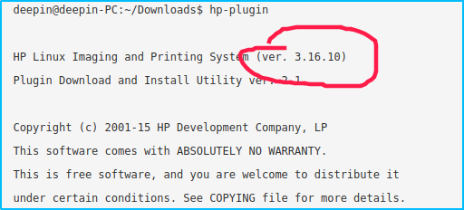

③根据版本号去[网站](https://www.openprinting.org/download/printdriver/auxfiles/HP/plugins/)下载对应的.run和.run.asc

④安装驱动：
终端输入hp-plugin，选择离线安装，导入刚刚下载的.run文件

⑥添加打印机：
打开系统的打印机程序，添加网络打印机，对应选择，一路`next`


#### 3.11 gedit

gedit中代码块注释，得在插件里开启“代码注释”，快捷键是`Ctrl+M`和`Ctrl+Shift+M`。

```shell
sudo apt install gedit-plugins 
```


#### 3.12 cmake

***编译安装的方式，下载的是`cmake-3.15.2.tar.Z`这样的文件，而后面复制安装的方式下载的是`cmake-3.15.2-Linux-x86_64.tar.gz`这样的文件，请注意对应下载***

##### 3.12.1 Cmake安装

下载[网站](https://cmake.org/download/#latest)

官网[教程](https://cmake.org/documentation/)

Ubuntu升级CMAKE教程：


在官网下载需要的版本，解压，然后执行命令：

```shell
sudo apt-get install build-essential
./configure
make
sudo apt-get install checkinstall
sudo checkinstall
sudo make install
```


安装之后的一些设置：

```shell
sudo rm /usr/bin/cmake
sudo ln -s /usr/local/bin/cmake /usr/bin/cmake
sudo rm /usr/bin/ctest
sudo ln -s /usr/local/bin/ctest /usr/bin/ctest
sudo rm /usr/bin/cpack
sudo ln -s /usr/local/bin/cpack /usr/bin/cpack
```


##### 3.12.2 Cmake使用之安装路径

cmake安装文件编译项目时指定安装路径：

①方法一：命令行中指定

```shell
cmake -DCMAKE_INSTALL_PREFIX=/usr ..
```

②方法二：CmakeLists.txt中指定

```cmake
SET(CMAKE_INSTALL_PREFIX < install_path >)
```


##### 3.12.3 Cmake使用之删除安装文件

```shell
cat install_manifest.txt | sudo xargs rm
```

之后再根据`install_manifest.txt`寻找安装时候新建的文件夹，把这些文件夹删除即可。


##### 3.12.4 cmake之直接复制安装

下载[网站](https://cmake.org/download/#latest)

官网[教程](https://cmake.org/documentation/)


下载解压后，分别执行下面的命令(以`cmake-3.15.1`为例)：

```shell
cd cmake-3.15.1-Linux-x86_64 # 根据下载的版本进行对应
sudo mv bin/* /usr/local/bin
sudo rm -r /usr/local/doc/cmake/* # 如果有这个文件夹，要先删除
sudo mv doc/cmake /usr/local/doc/
sudo mkdir -p /usr/local/man/man1
sudo mkdir -p /usr/local/man/man7
sudo mv man/man1/* /usr/local/man/man1   
sudo mv man/man7/* /usr/local/man/man7 
sudo mv share/aclocal/* /usr/local/share/aclocal
sudo mv share/applications/* /usr/local/share/aclocal
sudo mkdir -p /usr/local/share/cmake-3.15/
sudo mv share/cmake-3.15/* /usr/local/share/cmake-3.15/
sudo mkdir -p /usr/local/share/mime/packages/
sudo mv share/mime/packages/* /usr/local/share/mime/packages/
```


#### 3.13 Typora

```shell
wget -qO - https://typora.io/linux/public-key.asc | sudo apt-key add -
sudo add-apt-repository 'deb https://typora.io/linux ./'
sudo apt-get update
sudo apt-get install typora
```


#### 3.14 Mathpix

***推荐商店安装！！***

如果命令行安装：

```shell
sudo snap install mathpix-snipping-tool
```


#### 3.15 格式化代码astyle

参考我的QT的使用笔记。


#### 3.16 截屏录屏

软件：自带的`screenshot`加上`kazam`即可满足要求，前者系统自带，直接搜索即可得，后者安装可选软件中心安装，也可以命令行安装：

```shell
sudo apt install kazam
```


利用自带的截屏软件截屏，快捷键参考如下图（在设置中查看）：

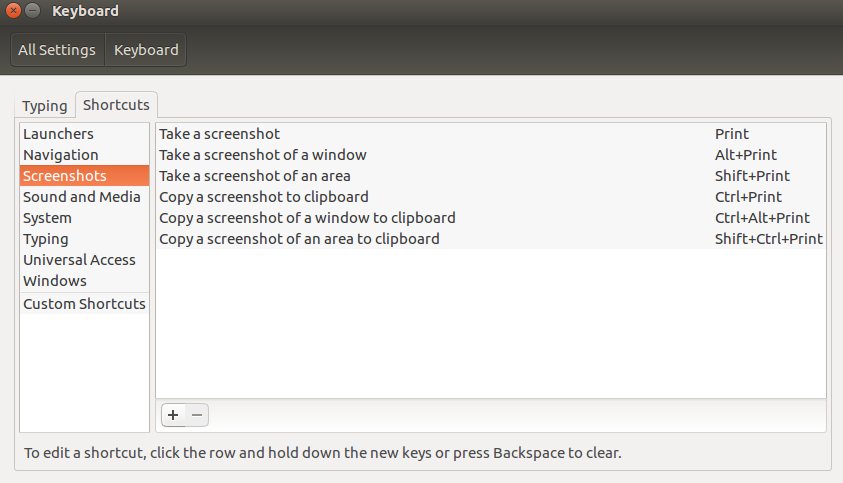


#### 3.17 clang

##### 3.17.1 命令行安装的clang

安装：

```shell
sudo apt install clang-6.0   # clang-6.0可以更换为其他的版本，具体需要参考Ubuntu库中提供的
```

安装完成之后，使用

```shell
clang -v
```

查看版本，一般并不是你选择的版本，因为Ubuntu16.04默认使用3.8，Ubuntu18.04默认使用的版本也不是6.0，所以安装完成之后需要进行软链接修改以确保选择（还有其他的方式选择clang的版本使用，方法待完善～）

```shell
cd /usr/bin
sudo rm clang
sudo ln -s clang-6.0 clang
sudo rm clang++
sudo ln -s clang++-6.0 clang++
```

之后再使用命令查看版本，则会显示：

```shell
clang version 6.0.0-1ubuntu2~16.04.1 (tags/RELEASE_600/final)
Target: x86_64-pc-linux-gnu
Thread model: posix
InstalledDir: /usr/bin
Found candidate GCC installation: /usr/bin/../lib/gcc/i686-linux-gnu/5
Found candidate GCC installation: /usr/bin/../lib/gcc/i686-linux-gnu/5.4.0
Found candidate GCC installation: /usr/bin/../lib/gcc/i686-linux-gnu/6
Found candidate GCC installation: /usr/bin/../lib/gcc/i686-linux-gnu/6.0.0
Found candidate GCC installation: /usr/bin/../lib/gcc/x86_64-linux-gnu/5
Found candidate GCC installation: /usr/bin/../lib/gcc/x86_64-linux-gnu/5.4.0
Found candidate GCC installation: /usr/bin/../lib/gcc/x86_64-linux-gnu/6
Found candidate GCC installation: /usr/bin/../lib/gcc/x86_64-linux-gnu/6.0.0
Found candidate GCC installation: /usr/lib/gcc/i686-linux-gnu/5
Found candidate GCC installation: /usr/lib/gcc/i686-linux-gnu/5.4.0
Found candidate GCC installation: /usr/lib/gcc/i686-linux-gnu/6
Found candidate GCC installation: /usr/lib/gcc/i686-linux-gnu/6.0.0
Found candidate GCC installation: /usr/lib/gcc/x86_64-linux-gnu/5
Found candidate GCC installation: /usr/lib/gcc/x86_64-linux-gnu/5.4.0
Found candidate GCC installation: /usr/lib/gcc/x86_64-linux-gnu/6
Found candidate GCC installation: /usr/lib/gcc/x86_64-linux-gnu/6.0.0
Selected GCC installation: /usr/bin/../lib/gcc/x86_64-linux-gnu/5.4.0
Candidate multilib: .;@m64
Selected multilib: .;@m64
Found CUDA installation: /usr/local/cuda, version unknown
```

类似内容。


##### 3.17.2 安装最新的clang

在[网站](http://releases.llvm.org/)下载需要的版本：

1. 点击版本对应的`download`，然后下拉看到`Pre-Built Binaries`字样，选择Ubuntu版本下载；
2. 下载后解压，然后将解压后的文件夹重命名为`clang_llvm`（不是非要重命名！）；
3. 将文件夹放在特定位置（建议在home目录下）；

写入环境：

```shell
gedit ~/.bashrc
```

然后添加如下内容：

```shell
# clang
export PATH="/home/vision/clang_llvm/bin:$PATH"
```

其中，路径`/home/vision/clang_llvm/bin`更换为实际路径即可。

终端下验证：

```shell
source ~/.bashrc
clang -v
```


#### 3.18 直接搜索软件库中的软件版本有哪些

```shell
sudo apt-cache search all | grep *** # ***为你要搜索的软件
```

比如搜索gcc：

```shell
sudo apt-cache search all | grep gcc
```

则会出现类似的显示：

```bash
gcc-5-aarch64-linux-gnu-base - GCC, the GNU Compiler Collection (base package)
gcc-5-arm-linux-gnueabihf-base - GCC, the GNU Compiler Collection (base package)
gcc-5-base - GCC, the GNU Compiler Collection (base package)
gcc-5-cross-base - GCC, the GNU Compiler Collection (library base package)
gcc-5-powerpc-linux-gnu-base - GCC, the GNU Compiler Collection (base package)
gcc-5-powerpc64le-linux-gnu-base - GCC, the GNU Compiler Collection (base package)
gcc-6-base - GCC, the GNU Compiler Collection (base package)
gcc-4.7-arm-linux-gnueabi-base - GCC, the GNU Compiler Collection (base package)
gcc-4.7-arm-linux-gnueabihf-base - GCC, the GNU Compiler Collection (base package)
gcc-4.7-base - GCC, the GNU Compiler Collection (base package)
gcc-4.8-aarch64-linux-gnu-base - GCC, the GNU Compiler Collection (base package)
gcc-4.8-arm-linux-gnueabihf-base - GCC, the GNU Compiler Collection (base package)
gcc-4.8-base - GCC, the GNU Compiler Collection (base package)
gcc-4.8-powerpc-linux-gnu-base - GCC, the GNU Compiler Collection (base package)
gcc-4.8-powerpc64le-linux-gnu-base - GCC, the GNU Compiler Collection (base package)
gcc-4.9-aarch64-linux-gnu-base - GCC, the GNU Compiler Collection (base package)
gcc-4.9-arm-linux-gnueabi-base - GCC, the GNU Compiler Collection (base package)
gcc-4.9-arm-linux-gnueabihf-base - GCC, the GNU Compiler Collection (base package)
gcc-4.9-base - GCC, the GNU Compiler Collection (base package)
gcc-4.9-powerpc-linux-gnu-base - GCC, the GNU Compiler Collection (base package)
gcc-4.9-powerpc64le-linux-gnu-base - GCC, the GNU Compiler Collection (base package)
gcc-4.9-s390x-linux-gnu-base - GCC, the GNU Compiler Collection (base package)
gcc-5-alpha-linux-gnu-base - GCC, the GNU Compiler Collection (base package)
gcc-5-arm-linux-gnueabi-base - GCC, the GNU Compiler Collection (base package)
gcc-5-cross-base-ports - GCC, the GNU Compiler Collection (library base package)
gcc-5-hppa-linux-gnu-base - GCC, the GNU Compiler Collection (base package)
gcc-5-m68k-linux-gnu-base - GCC, the GNU Compiler Collection (base package)
gcc-5-mips-linux-gnu-base - GCC, the GNU Compiler Collection (base package)
gcc-5-mips64-linux-gnuabi64-base - GCC, the GNU Compiler Collection (base package)
gcc-5-mips64el-linux-gnuabi64-base - GCC, the GNU Compiler Collection (base package)
gcc-5-mipsel-linux-gnu-base - GCC, the GNU Compiler Collection (base package)
gcc-5-powerpc-linux-gnuspe-base - GCC, the GNU Compiler Collection (base package)
gcc-5-powerpc64-linux-gnu-base - GCC, the GNU Compiler Collection (base package)
gcc-5-s390x-linux-gnu-base - GCC, the GNU Compiler Collection (base package)
gcc-5-sh4-linux-gnu-base - GCC, the GNU Compiler Collection (base package)
gcc-5-sparc64-linux-gnu-base - GCC, the GNU Compiler Collection (base package)
gcc-mingw-w64-base - GNU Compiler Collection for MinGW-w64 (base package)
gcc-opt - allow global optimization flags for gcc, g++
gcc-python-plugin-doc - plugin for GCC to invoke Python scripts from inside the compiler
gcc-python3-dbg-plugin - plugin for GCC to invoke Python scripts from inside the compiler
gcc-python3-plugin - plugin for GCC to invoke Python scripts from inside the compiler
gcc-snapshot - SNAPSHOT of the GNU Compiler Collection
gccintro - Introduction to GCC by Brian J. Gough
gcc-4.4-base - GCC, the GNU Compiler Collection (base package)
gcc-4.5-base - The GNU Compiler Collection (base package)
gcc-4.6-base - GCC, the GNU Compiler Collection (base package)
gcc-7-base - GCC, the GNU Compiler Collection (base package)
gcc-8-base - GCC, the GNU Compiler Collection (base package)
gcc-9-base - GCC, the GNU Compiler Collection (base package)
```


#### 3.19 gcc/g++

gcc和g++是Ubuntu默认的编辑器(cmake一般都是默认调用这个)，一般安装方法是：

```shell
sudo apt install build-essential
sudo apt install gcc g++
```


##### 3.19.1 安装最新的或者比较新的gcc/g++

由于ubuntu软件库中提供的gcc/g++版本一般都是比较陈旧的，比如Ubuntu16.04最高只有gcc-5，如果需要c++1y标准的程序编译，最好是安装更新的gcc/g++，安装方式如下：

```shell
sudo add-apt-repository ppa:ubuntu-toolchain-r/test
sudo apt update
sudo apt install gcc-9 g++-9  # 后面的９可以更换为你想要的版本
```


##### 3.19.2 配置优先级(其他软件也可以参考)

以已安装的gcc-5/g++-5/gcc-9/g++-9为例：

1. 首先创建符号链接以及优先级(下面的10/20表示优先级，数值越大表示优先级越高)：

```bash
sudo update-alternatives --install /usr/bin/gcc gcc /usr/bin/gcc-5 10
sudo update-alternatives --install /usr/bin/gcc gcc /usr/bin/gcc-9 20
sudo update-alternatives --install /usr/bin/g++ g++ /usr/bin/g++-5 10
sudo update-alternatives --install /usr/bin/g++ g++ /usr/bin/g++-9 20
```

2. 之后可以自己配置替代品(上面的优先级设置了基本上就可以了，但是可以执行之后的步骤确保无误)：

```shell
sudo update-alternatives --config gcc
```

可以看到：

```shell
There are 2 choices for the alternative gcc (providing /usr/bin/gcc).

  Selection    Path            Priority   Status
------------------------------------------------------------
* 0            /usr/bin/gcc-9   20        auto mode
  1            /usr/bin/gcc-5   10        manual mode
  2            /usr/bin/gcc-9   20        manual mode

Press <enter> to keep the current choice[*], or type selection number:
```

可以手动选择，比如输入１，则表示使用gcc-5作为默认的gcc编译器（上面显示表示默认gcc-9）。

```shell
sudo update-alternatives --config g++
```

可以看到：

```shell
There are 2 choices for the alternative g++ (providing /usr/bin/g++).

  Selection    Path            Priority   Status
------------------------------------------------------------
* 0            /usr/bin/g++-9   20        auto mode
  1            /usr/bin/g++-5   10        manual mode
  2            /usr/bin/g++-9   20        manual mode

Press <enter> to keep the current choice[*], or type selection number:
```

可以手动选择，比如输入１，则表示使用g++5作为默认的g++编译器（上面显示表示默认g++-9）。

3. 之后执行命令可以查看当前使用的版本

```shell
gcc -v
```

显示：

```shell
Using built-in specs.
COLLECT_GCC=gcc
COLLECT_LTO_WRAPPER=/usr/lib/gcc/x86_64-linux-gnu/9/lto-wrapper
OFFLOAD_TARGET_NAMES=nvptx-none
OFFLOAD_TARGET_DEFAULT=1
Target: x86_64-linux-gnu
Configured with: ../src/configure -v --with-pkgversion='Ubuntu 9.1.0-2ubuntu2~16.04' --with-bugurl=file:///usr/share/doc/gcc-9/README.Bugs --enable-languages=c,ada,c++,go,brig,d,fortran,objc,obj-c++ --prefix=/usr --with-gcc-major-version-only --program-suffix=-9 --program-prefix=x86_64-linux-gnu- --enable-shared --enable-linker-build-id --libexecdir=/usr/lib --without-included-gettext --enable-threads=posix --libdir=/usr/lib --enable-nls --enable-bootstrap --enable-clocale=gnu --enable-libstdcxx-debug --enable-libstdcxx-time=yes --with-default-libstdcxx-abi=new --enable-gnu-unique-object --disable-vtable-verify --enable-plugin --with-system-zlib --with-target-system-zlib=auto --enable-objc-gc=auto --enable-multiarch --disable-werror --with-arch-32=i686 --with-abi=m64 --with-multilib-list=m32,m64,mx32 --enable-multilib --with-tune=generic --enable-offload-targets=nvptx-none --without-cuda-driver --enable-checking=release --build=x86_64-linux-gnu --host=x86_64-linux-gnu --target=x86_64-linux-gnu
Thread model: posix
gcc version 9.1.0 (Ubuntu 9.1.0-2ubuntu2~16.04) 
```


#### 3.20 Python

pip更换为国内源

```shell
mkdir ~/.pip
gedit ~/.pip/pip.conf
```

在文件中写入：

```shell
[global]
timeout = 6000
index-url = https://mirrors.aliyun.com/pypi/simple/
trusted-host = mirrors.aliyun.com
```


##### 3.20.1 Python安装

[下载网址](https://www.python.org/ftp/python/)

下载tar压缩包，解压，比如python3.7.4

```shell
sudo apt-get install zlib1g-dev libbz2-dev libssl-dev libncurses5-dev libsqlite3-dev libreadline-dev tk-dev libgdbm-dev libdb-dev libpcap-dev xz-utils libexpat1-dev liblzma-dev libffi-dev libc6-dev

sudo mkdir /usr/local/python3  # python3可以更换为你想啊要的命名
cd python3.7.4
./configure --prefix=/usr/local/python3
make 
sudo make install
```

无报错则安装成功。


##### 3.20.2 Python软链接(<u>不建议将python更高版本设置为默认的，会出现错误！！！ pass this step</u>)

```shell
sudo update-alternatives --install /usr/bin/python3 python3 /usr/bin/python3.5 20
sudo update-alternatives --install /usr/bin/python3 python3 /usr/local/python3/bin/python3.7 10
```


##### 3.20.3 使用python3.7

```shell
cd /usr/local/python3/bin
sudo rm 2to3 idle3 pydoc3 python3 python3-config pyvenv
gedit ~/.bashrc
```

添加内容：

```shell
# python3.7
export PATH="/usr/local/python3/bin:$PATH"
```

之后执行：

```shell
source ~/.bashrc
```

使用Python3.7和对应的pip请使用命令：

```shell
python3.7   # 使用python3.7
pip3.7      # 使用pip3.7
```


##### 3.20.3 问题解决

python3.7使用出现问题的解决：

安装之后使用pip3.7安装包的时候报错：

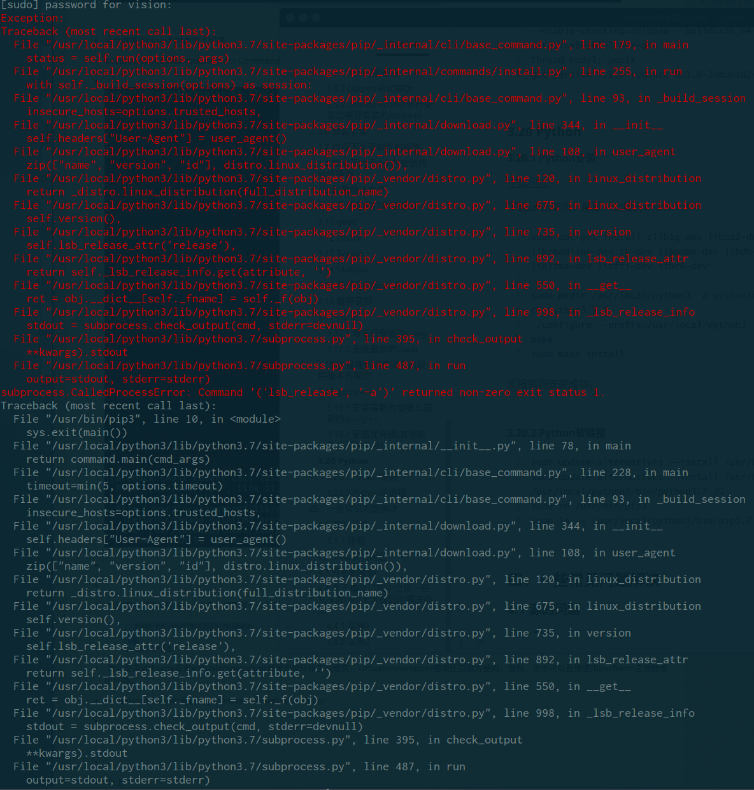

解决办法：

```shell
sudo rm /usr/bin/lsb_release
```

理由：不知道～


#### 3.21 ros

##### 3.21.1 gazebo打不开一直卡在"Preparing your world"

在运行某些程序的功能包的时候，gazebo启动的时候会一直卡在"Preparing your world"，然后就一直不动了，这是由于gazebo在下载某些模型导致的，多等上一会，或者执行下面的命令手动把模型下全，如果还是不能打开那说明要下载的模型不在这个列表里面，知道这个模型是什么可以去手动下载，如果不知道的话就只有多等一会看能不能下完打开了。

```shell
cd ~/.gazebo/
hg clone https://bitbucket.org/osrf/gazebo_models models
```


#### 3.22 eigen

下载[网址](http://eigen.tuxfamily.org/index.php?title=Main_Page)

下载之后解压，进入解压后的文件夹：

```shell
mkdir build && cd build
cmake -DCMAKE_INSTALL_PREFIX=/usr ..
sudo make install   # 因为eigen是头文件组成的包，所以不需要make
```


#### 3.23 WPS

[下载地址](https://linux.wps.cn/)

***无法输入中文的解决***

wps文字：

```shell
sudo gedit /usr/bin/wps
```

然后在`#!/bin/bash`后面换行添加：

```shell
export XMODIFIERS="@im=fcitx"
export QT_IM_MODULE="fcitx"
```


wps表格：

```shell
sudo gedit /usr/bin/et
```

然后在`#!/bin/bash`后面换行添加：

```shell
export XMODIFIERS="@im=fcitx"
export QT_IM_MODULE="fcitx"
```


wps演示：

```shell
sudo gedit /usr/bin/wpp
```

然后在`#!/bin/bash`后面换行添加：

```shell
export XMODIFIERS="@im=fcitx"
export QT_IM_MODULE="fcitx"
```


#### 3.24 Ubuntu显示大小写和数字键盘状态

```shell
sudo add-apt-repository ppa:tsbarnes/indicator-keylock
sudo apt update
sudo apt install indicator-keylock
```


#### 3.25 电源管理

Slimbook Battery Optimizer可以快速切换电源模式来延长续航时间。

```shell
sudo add-apt-repository ppa:slimbook/slimbook
sudo apt update
sudo apt install slimbookbattery
```

如果要卸载，使用：

```shell
sudo apt remove slimbookbattery
sudo add-apt-repository -r ppa:slimbook/slimbook
```


#### 3.26 ceres库安装

命令行执行：

```shell
sudo apt-get install liblapack-dev libsuitesparse-dev libgflags-dev libgoogle-glog-dev libgtest-dev
```

需要安装另一个依赖`libcxsparse`，由于有版本的关系，稍微复杂：

```shell
sudo apt install libcxsparse
```

输入以上命令之后不要回车，在键盘上按一下Tab键，会自动补全，然后安装。


[ceres库](https://github.com/ceres-solver/ceres-solver)下载之后，进入文件


#### 3.27 GDB调试的问题解决办法

##### 3.27.1 GDB调试正在运行的程序出错

报错：

```shell
Could not attach to process.  If your uid matches the uid of the target
process, check the setting of /proc/sys/kernel/yama/ptrace_scope, or try
again as the root user.  For more details, see /etc/sysctl.d/10-ptrace.conf
ptrace: Operation not permitted.
```

解决办法：

```shell
sudo gedit /etc/sysctl.d/10-ptrace.conf 
```

然后讲最后一句的值改为0，然后重启即可。

```shell
kernel.yama.ptrace_scope = 0
```


#### 3.28 PDF阅读器

使用okular

安装方式：

```shell
sudo apt install okular
```


#### 3.29 Albert

[安装](https://software.opensuse.org/download.html?project=home:manuelschneid3r&package=albert)

配置：

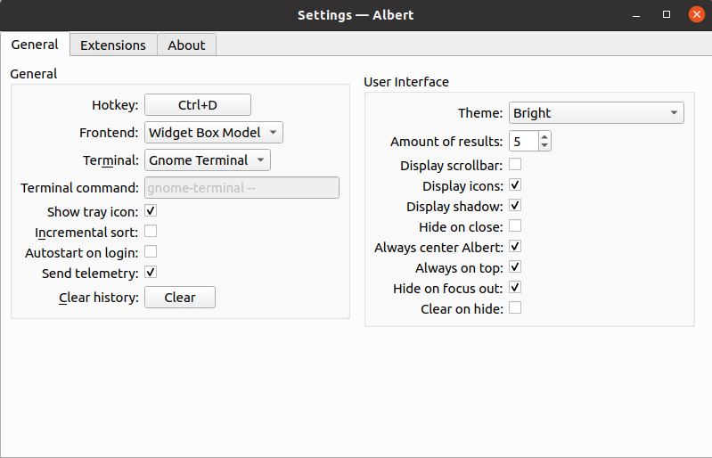

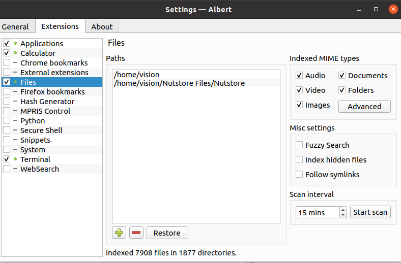


### 四、一些常见问题解决

#### 4.1 源的问题

##### 4.1.1 秘钥

`问题`：类似The following signatures couldn't be verified because the public key is not available: NO_PUBKEY F42ED6FBAB17C654报没有秘钥的错误

`解决`：需要在源中添加秘钥，执行命令

```shell
sudo apt-key adv --keyserver 'hkp://keyserver.ubuntu.com:80' --recv-key 'F42ED6FBAB17C654' #对应替换秘钥即可
```


#### 4.2 Snap安装问题

错误：Ubuntu snap提示has “install-snap” change in progress 错误

解决：

**其实就是软件之前安装了一次，只是没安装完就强行停止了**，执行命令行：

```shell
snap changes
```

根据显示结果查看，标示为Doing的即没有安装完就强行停止的进程，然后：

```shell
sudo snap abort num  # num为Doing标示的序号
```

实例分析：

```shell
ID   Status  Spawn               Ready               Summary
1    Done    today at 10:32 CST  today at 10:32 CST  Initialize system state
2    Doing   today at 20:41 CST  -                   Install "mathpix-snipping-tool" snap
3    Done    today at 20:41 CST  today at 20:41 CST  Initialize device
```

此时num应该为2.


#### 4.3 开机即报错

问题描述：Ubuntu开机就报错`ubuntu system program problem detected`

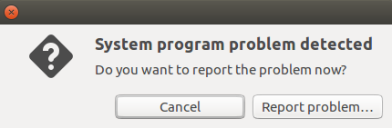

解决办法：

```shell
sudo gedit /etc/default/apport 
```

将enabled=1改为enabled=0保存退出即可，重启之后即可生效。


#### 4.4 关于编译过程中出现一些共享库(.so)无法找到的解决办法

##### 4.4.1 实例1

问题：make[2]: *** No rule to make target '/usr/lib/x86_64-linux-gnu/libGL.so'

问题分析：很多Linux环境下出现此类Bug时，一般大部分原因是因为make 编译的时候，动态链接库的链接性中断，因此解决方案为添加symlink(符号链接)。

解决：

1. 定位libGL.so文件路径： 比如，本机中路径为：/usr/lib/x86_64-linux-gnu/libGL.so；

2. 定位/usr/lib/目录下存在类似的共享库文件，如：libGL.so.1；

3. 建立symlink: （之所以链接到libGL.so.1而不是libGL.so可能是为了便于区分）

   ```shell
   sudo ln -s  /usr/lib/libGL.so.1  /usr/lib/x86_64-linux-gnu/libGL.so
   ```

4. 如果出现错误：
   `ln: failed to create symbolic link '/usr/lib/x86_64-linux-gnu/libGL.so' : File exists`

   则删除已有的链接：

   ```shell
   sudo rm /usr/lib/x86_64-linux-gnu/libGL.so
   ```

5. 重新执行步骤3。


##### 4.4.2 实例2

问题：The imported target “Qt5::Gui” references the file “/usr/lib/x86_64-linux-gnu/libEGL.so” but this file does not exist.

问题分析：在Linux中，主要分析Ubuntu系统，会内置qt4和qt5的部分共享库文件，这是系统中的组成部分，但是共享库的链接并不一定都能被编译器捕捉到，即链接中断。

解决：同**实例1**的解决办法

```shell
sudo rm /usr/lib/x86_64-linux-gnu/libEGL.so
sudo ln /usr/lib/x86_64-linux-gnu/libEGL.so.1 /usr/lib/x86_64-linux-gnu/libEGL.so
```


#### 4.5 Ubuntu启动项丢失的解决办法

Ubuntu的启动项丢失一般有两种原因，一种是由于WIndows升级或者系统按键启动时按错导致BIOS顺序调整，一种纯粹是因为Ubuntu下错误操作导致启动项丢失，分别对应如下的解决办法。

##### 4.5.1 从BIOS中解决

进入到电脑的BIOS（不同的电脑不同，一般为F1 F2），然后在boot中调整系统启动顺序即可。


##### 4.5.2 修复Ubuntu的启动项

1. 使用制作的安装系统U盘，然后选择`Try Ubuntu without Install`；

2. 打开终端输入如下命令：

```shell
sudo add-apt-repository ppa:yannubuntu/boot-repair
sudo apt-get update
sudo apt-get install boot-repair
```

3. 然后在dash中搜索boot-repair，点击进入，选择recommand repair，之后就会自动执行相关修复工作，等待修复成功，拔掉U盘，重新开机；

4. 开机之后会发现界面上的选择多了不少，可以选择在Ubuntu的对应文件中删除一些：

```shell
sudo cp /boot/grub/grub.cfg /boot/grub/grub.cfg_backup
sudo gedit /boot/grub/grub.cfg 
```

如果发现没有权限修改则使用下面的方式：

```shell
sudo su
cp /boot/grub/grub.cfg /boot/grub/grub.cfg_backup　　#先备份一下
cat /boot/grub/grub.cfg > tmp　　#将内容重定向到其他文件，便于修改
gedit tmp　　#或者vim tmp
```

5. 删除如下两句之间的内容：

```shell
### BEGIN /etc/grub.d/25_custom ###

　menuentry "Windows UEFI bootmgfw.efi" {
　search --fs-uuid --no-floppy --set=root 84F5-6727
　chainloader (${root})/EFI/Microsoft/Boot/bootmgfw.efi
　}

　menuentry "Windows Boot UEFI loader" {
　search --fs-uuid --no-floppy --set=root 84F5-6727
　chainloader (${root})/EFI/Boot/bkpbootx64.efi
　}

　... 

 menuentry "Windows Boot UEFI recovery bkpbootx64.efi" {
 search --fs-uuid --no-floppy --set=root 5686-D913
 chainloader (${root})/efi/Boot/bkpbootx64.efi
 }
 ### END /etc/grub.d/25_custom ###
```

即从`### BEGIN /etc/grub.d/25_custom ###`到`### END /etc/grub.d/25_custom ###`之间的内容。

6. 删除之后保存，执行命令：

```shell
reboot
```

如果之前因为权限修改方式采用的第二种，则执行如下命令：

```shell
cat tmp > /boot/grub/grub.cfg
reboot
```

大功告成~
