## Windows使用笔记
### 一、系统安装

可去[MSDN](https://msdn.itellyou.cn/)网站下载`Windows10`，可以使用`Rufus`制作启动U盘安装，也可以直接覆盖安装。

破解可去[亦是美网络](http://www.yishimei.cn/network/319.html)下载破解软件进行破解，该软件还可以破解微软其他软件，如`office`，`visio`。


***推荐软件***

|   需求    |    软件    |                    下载地址                    |    需求    |     软件     |                      下载地址                      |
| :-------: | :--------: | :--------------------------------------------: | :--------: | :----------: | :------------------------------------------------: |
| 文档书写  |   Typora   |        [Typora](https://www.typora.io/)        |    邮箱    | 网易邮箱大师 |     [网易邮箱大师](http://mail.163.com/dashi/)     |
| 视频剪辑  |  Filmora   |                    百度网盘                    |  快速检索  |   Listary    |     [Listary](https://www.listarypro.com/pro)      |
| 快速预览  | QuickLook  |                    微软商店                    |  文件同步  |    坚果云    |                      微软商店                      |
|  输入法   | 百度输入法 |   [百度输入法](https://shurufa.baidu.com/ )    |   浏览器   |    chrome    | [chrome](https://www.google.cn/intl/zh-CN/chrome/) |
|   终端    |  微软终端  |                    微软商店                    |   浏览器   |     火狐     |         [火狐](http://www.firefox.com.cn/)         |
|  编程IDE  |  VS  Code  |   [VS Code](https://code.visualstudio.com/)    |   浏览器   |   360极速    |       [360极速](https://browser.360.cn/ee/)        |
| C++编译器 |  mingw64   | [官网](http://mingw-w64.org/doku.php)/百度网盘 |  格式转换  |   格式工厂   |        [格式工厂](http://www.pcgeshi.com/)         |
| 压缩软件  |  BandZip   |      [BandZip](http://www.bandisoft.com/)      | 启动盘制作 |    rufus     |             [Rufus](http://rufus.ie/)              |
|           |            |                                                | 启动盘制作 |    软碟通    |         [软碟通](https://cn.ultraiso.net/)         |
|           |            |                                                |            |              |                                                    |


#### 1.1 系统操作小技巧

快速到达AppData路径

直接在文件管理器的地址栏输入如下字符，然后回车。

```shell
%appdata%
```


### 二、系统设置

#### 2.1 环境变量设置

`我的电脑`右键 ->  `高级系统设置`  ->  `环境变量`  之后的操作如下：

在`系统变量`中选择 `Path` ，然后点击 `编辑…` 进入 `编辑环境变量` 窗口，点击`新建` ，之后将环境变量所在路径填入即可。

添加环境变量后一般需要重启才能生效。


#### 2.2 安装软件的时候报错

报错：您的安全设置不允许将此应用程序安装到您的计算机上。

解决办法：

在该目录下新建一个记事本文件，复制以下内容：

```shell
Windows Registry Editor Version 5.00
 
[HKEY_LOCAL_MACHINE\SOFTWARE\Microsoft\.NETFramework\Security\TrustManager\PromptingLevel]
 
"MyComputer"="Enabled"
 
"LocalIntranet"="Enabled"
 
"Internet"="Enabled"
 
"TrustedSites"="Enabled"
 
"UntrustedSites"="Disabled"
```

保存关闭后，更改文件格式为`.reg`，命名任意，然后双击启用。

之后再安装该程序即可。


#### 2.3 添加右键新建XX文档

**<u>比如，添加右键新建cpp文档</u>**，方式有两种：

两种方法的预先步骤都是要在电脑某一个位置新建一个cpp文件，并且***不能删除***！

假设在C盘一个位置新建了文件，距离路径为：`C:\Windows\Template\cppFile.cpp`

1. 直接在注册表修改添加:

   打开注册表（win+r   regedit)，找到[HKEY_CLASSES_ROOT] -> [.cpp] （没有的话，自己新建项.cpp）；

   在 [.cpp] 下新建项 [ShellNew] （已经有的话就删掉重建）；

   在 [ShellNew] 下新建 字符串值 ，名称为 FileName ，键值为模板文件的绝对路径-------`C:\Windows\Template\cppFile.cpp`


2. 通过写注册表文件：

   新建一个.reg文档，写入如下内容，之后双击运行

   ```shell
   Windows Registry Editor Version 5.00
   
   [HKEY_CLASSES_ROOT\.cpp\ShellNew]
   "FileName"="C:\Windows\Template\cppFile.cpp"
   "NullFile"=""
   ```


两个步骤之后都是需要重启电脑生效。


> .md文件的特殊使用如下注册表实现（在这之前要安装typora)
>
> ```shell
> Windows Registry Editor Version 5.00
> 
> [HKEY_CLASSES_ROOT\.md]
> @="Typora.md"
> "Content Type"="text/markdown"
> "PerceivedType"="text"
> 
> [HKEY_CLASSES_ROOT\.md\ShellNew]
> "NullFile"=""
> ```


#### 2.4 解决系统卡顿的几个设置

##### 2.4.1 使用任务管理器

在任务管理器中的`启动`项中设置软件是否开机启动。


##### 2.4.2 利用第三方软件

比如360或者电脑管家，进入软件的自启动管理进行设置。


##### 2.4.3 利用服务项设置

使用`win`+`r`，输入`msconfig`打开服务项如下：

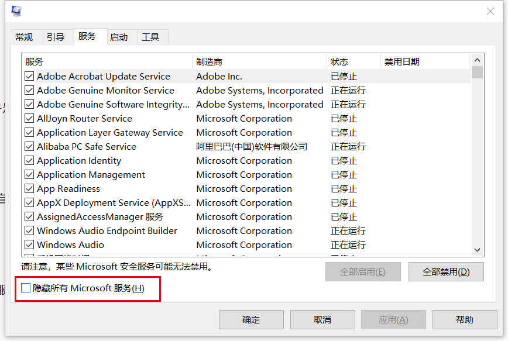

可以借助红框部分的选项针对设置。


### 三、软件安装

#### 3.1 mingw配置安装

##### 3.1.1 直装mingw  gcc g++

mingw的[官网](http://mingw-w64.org/doku.php)

由于根据下载安装器下载安装的速度极慢(伟大的社会主义墙你懂的)，所以我们直接下载编译文件，进入[下载网站](https://sourceforge.net/projects/mingw-w64/files/mingw-w64/mingw-w64-release/)，下拉，可以看到如下：

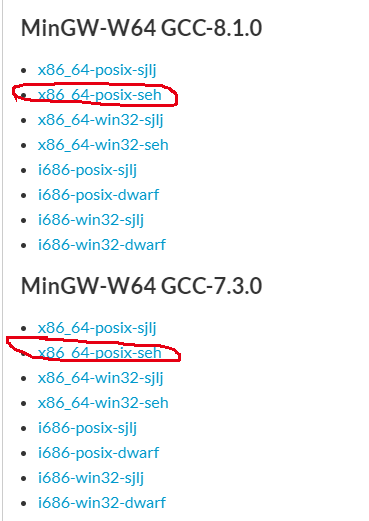

选择`x86_64-posix-silj`或者`x86_64-posix-seh`下载，推荐使用`seh`，具体版本就随意了，当然越新越好了~

将下载的压缩包放到C盘根目录下(推荐)，解压，虽然压缩包很小，但是解压后的文件非常大，所以耐心等待吧~

解压之后，在系统中添加环境变量`C:\mingw64\bin`，这个环境变量根据你解压后放的位置有关，具体问题具体对待了。

安装完成~


##### 3.1.2 mingw的一些配置

在Linux系统下，可以很便捷很用如下命令：

```shell
cmake ..
make
```

但是在安装上述软件之后，发现在Windows的终端并不能执行`make`这个命令，则需要进行配置。

> 首先发现在终端`mingw32-make.exe`的作用和`make`的作用相同，那么解决方案就是进入mingw的安装目录中的`bin`目录下，在该目录下复制已经存在的`mingw32-make.exe`，并将复制后的文件重新命名为`make.exe`。返回终端之后就可以使用`make`指令了~


#### 3.2 clang的exe安装（推荐方法）

##### 3.2.1 安装教程

在[网站](http://releases.llvm.org/)下载需要的版本：

1. 点击版本对应的`download`，然后下拉看到`Pre-Built Binaries`字样，选择windows64版本下载；
2. 下载后直接双击安装；
3. 写入环境变量`C:\Program Files\LLVM\bin`


##### 3.2.2 使用教程

clang/clang++命令均可以在Windows下使用，但是可能会出现类似如下的警告：

```shell
clang_test-ce8795.o : warning LNK4217: 本地定义的符号 __std_terminate 在函数 "int `public: static unsigned __int64 __cdecl std::char_traits<char>::length(char const * const)'::`1'::dtor$2" (?dtor$2@?0??length@?$char_traits@D@std@@SA_KQEBD@Z@4HA) 中导入
clang_test-ce8795.o : warning LNK4217: 本地定义的符号 _CxxThrowException 在函数 "public: void __cdecl std::ios_base::clear(int,bool)" (?clear@ios_base@std@@QEAAXH_N@Z) 中导入
```

所以在Windows下需要使用其他的命令格式`clang-cl`

比如：

```shell
clang-cl test.cpp -o text.exe
```


#### 3.3 Cmake（以及使用Cmake和mingw编译库文件）

cmake[下载网站](https://cmake.org/download/)

cmake[官网教程](https://cmake.org/documentation/)

下载需要的版本，然后安装，记住要勾选所有用户安装和写入环境变量~


编译库文件：

1. 打开cmake gui：

   红色框分别选中要编译的库文件所在位置，以及你想要把编译的文件所放的位置。

   然后选中绿色框Configure，配置如mingw设置图，一般选择为该图中的红色框和蓝色框，如果存在多个版本的mingw，则需要使用绿色框指定版本。

   蓝色框填写要安装的位置，推荐"C:/Program Files/###"，其中###为定义的名称，以及配置红色背景的其他选项，具体配置看要求，一般取消"BUILD_TESTING"和"BUILD_EXAMPLE"。

   再次点击绿色框Configure，然后点击深红色框Generate。

   

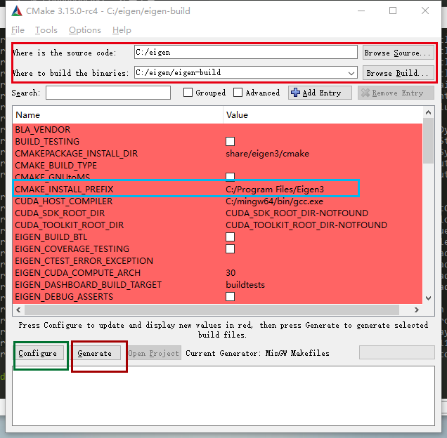

<center>cmake gui界面配置</center>

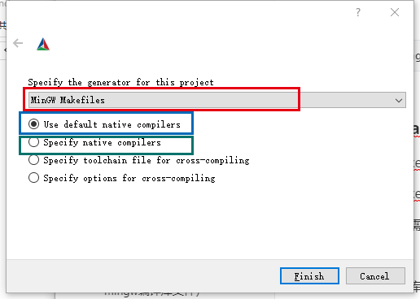

<center>mingw设置</center>

2. 如果设置安装的位置是C盘，则需要以管理员身份打开终端软件，进入到编译文件所在位置，比如图中的"C:/eigen/eigen-build"，使用命令完成编译安装：

```shell
make install
```


#### 3.4 cmder

##### 3.4.1 下载安装

[官网](<https://cmder.net/>)下载，下载完整版为佳。

下载之后解压，放到某一个文件夹下，建议放在C盘。

##### 3.4.2 配置

详细配置可见[文章](<https://blog.51cto.com/13853366/2352632>)

①在系统属性里面配置环境变量，将`Cmder.exe`所在文件路径添加至`Path`里，如下：

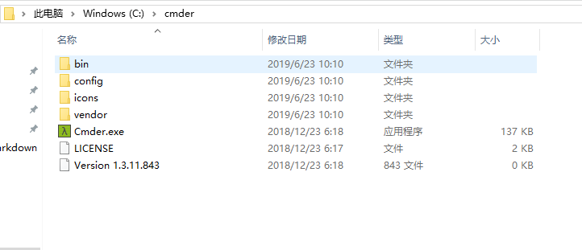

则是在`环境变量`中添加：

```
C:\cmder
```

②设置中文界面

打开软件，点击右下角的`三`形状的图标，进入设置页面，如下：

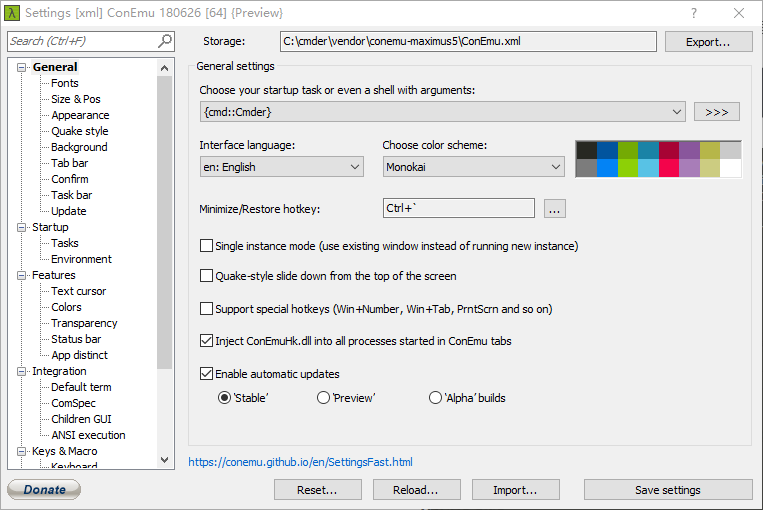

在Interface language中选择简体中文即可。

③设置显示设置

在`Startup` -> `Environment`中加入语句：

```shell
set LC_ALL=zh-CN.UTF8
chcp 65001
```

在`General` -> `Fonts`取消`Monospace`字体

④设置模式

在设置中直接点击`Startup`，设置如下：

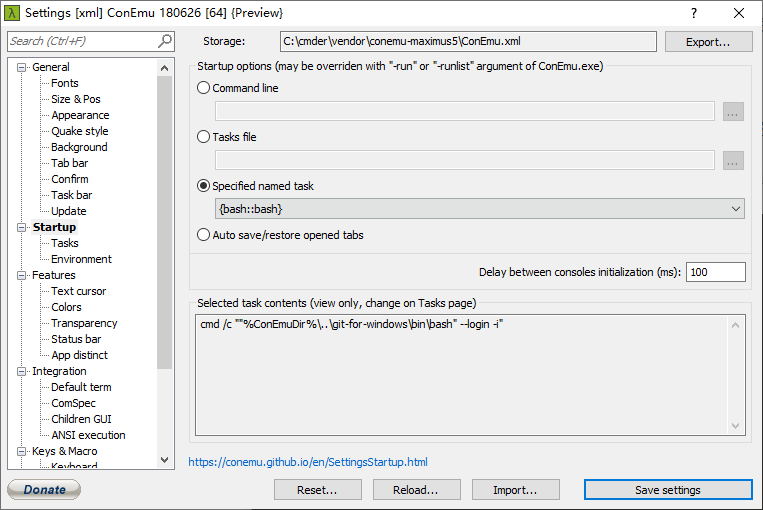

⑤设置任意目录右键打开cmder

以**管理员权限**打开系统的`cmd`，执行命令：

```shell
Cmder.exe /REGISTER ALL
```

⑥关闭每次关闭cmder时都弹窗提醒Confirm closing console?

进入设置页面，`General` -> `Confirm` -> `Close confirmations`

点击取消`When running process was detected `的选中状态即可关闭弹窗提醒。


#### 3.5 坚果云

坚果云[下载地址](https://www.jianguoyun.com/)

正常安装登录即可。

安装坚果云之后会在我的电脑界面多一个坚果云的图标，很是讨厌，解决办法：

打开注册表：`win+R`，输入`regedit`，会进入到注册表界面；

在上方地址栏复制内容：

`\HKEY_LOCAL_MACHINE\SOFTWARE\Microsoft\Windows\CurrentVersion\Explorer\MyComputer\NameSpace`

然后从上到下依次搜索哪个是坚果云的注册表，删除即可。

回到我的电脑页面，刷新一下就可以发现没有了坚果云的图标。


#### 3.6 Windows添加右键菜单应用程序

参考[博客]( https://blog.csdn.net/aiwangtingyun/article/details/89920825 )


#### 3.7 Adobe Acrobat DC的使用设置

##### 3.7.1 设置打开PDF自动从上次阅读处开始

`编辑`->`首选项`->`文档`->`打开设置`

勾选`重新打开文档时恢复上次视图设置`


#### 3.8 tensorflow深度学习环境


#### 3.9 Python

##### 3.9.1 设置pip源为国内源

打开文件资源管理器，然后在地址栏输入%appdata%，进入文件夹，新建一个文件夹pip，然后新建文件pip.ini，添加如下内容：

```ini
[global]
timeout = 6000
index-url = https://mirrors.aliyun.com/pypi/simple/
trusted-host = mirrors.aliyun.com
```


#### 3.10 Windows Terminal

配置文件目录：

`C:\Users\Username\AppData\Local\Packages\Microsoft.WindowsTerminal_8wekyb3d8bbwe\LocalState`

##### 3.10.1 配置主题字体

```json
{
    "$schema": "https://aka.ms/terminal-profiles-schema",

    "defaultProfile": "{61c54bbd-c2c6-5271-96e7-009a87ff44bf}",

    "copyOnSelect": false,

    // If enabled, formatted data is also copied to your clipboard
    "copyFormatting": false,

    "profiles":
    {
        "defaults":
        {
            // Put settings here that you want to apply to all profiles.
        },

        "list":
        [
            {
                // Make changes here to the powershell.exe profile
                // powershell
                "acrylicOpacity" : 0.5,
                "backgroundImage" : "C:/Users/vision/Pictures/Wallpaper/pic1.jpg",//对应修改
                "backgroundImageOpacity" : 0.5,
                "backgroundImageStretchMode" : "fill",
                "closeOnExit" : true,
                "colorScheme" : "Campbell",
                "commandline" : "powershell.exe",
                "cursorColor" : "#FFFFFF",
                "cursorShape" : "bar",
                "fontFace" : "DejaVu Sans Mono",
                "fontSize" : 13,
                // "foreground" : "#FF4500",//字体颜色
                "guid": "{61c54bbd-c2c6-5271-96e7-009a87ff44bf}",//对应修改
                "historySize" : 9001,
                "icon" : "ms-appx:///ProfileIcons/{61c54bbd-c2c6-5271-96e7-009a87ff44bf}.png",
                "name" : "Windows PowerShell",
                "padding" : "0, 0, 0, 0",
                "snapOnInput" : true,
                "startingDirectory" : "%USERPROFILE%",
                "tabTitle" : "powershell",
                "useAcrylic" : false
                //"hidden": false
            },
            {
                // Make changes here to the cmd.exe profile
                //cmd
                "acrylicOpacity" : 0.75,
                "backgroundImage" : "C:/Users/vision/Pictures/Wallpaper/pic2.jpg",//对应修改
                "backgroundImageOpacity" : 0.5,
                "backgroundImageStretchMode" : "fill",
                "closeOnExit" : true,
                "colorScheme" : "Campbell",
                "commandline" : "cmd.exe",
                "cursorColor" : "#FFFFFF",
                "cursorShape" : "bar",
                "fontFace" : "DejaVu Sans Mono",
                "fontSize" : 13,
                // "foreground" : "#FF4500",
                "guid": "{0caa0dad-35be-5f56-a8ff-afceeeaa6101}",//对应修改
                "historySize" : 9001,
                "icon" : "ms-appx:///ProfileIcons/{0caa0dad-35be-5f56-a8ff-afceeeaa6101}.png",
                "name" : "cmd",
                "padding" : "0, 0, 0, 0",
                "snapOnInput" : true,
                "startingDirectory" : "%USERPROFILE%",
                "tabTitle" : "cmd",
                "useAcrylic" : false
                //"hidden": false
            },
            {
                "guid": "{b453ae62-4e3d-5e58-b989-0a998ec441b8}",
                "hidden": false,
                "name": "Azure Cloud Shell",
                "source": "Windows.Terminal.Azure"
            }
        ]
    },

    // Add custom color schemes to this array.
    // To learn more about color schemes, visit https://aka.ms/terminal-color-schemes
    "schemes": [
        {
            "name": "Campbell",
            "foreground": "#F2F2F2",
            "background": "#0C0C0C",
            "colors": [
              "#0C0C0C",
              "#C50F1F",
              "#13A10E",
              "#C19C00",
              "#0037DA",
              "#881798",
              "#3A96DD",
              "#CCCCCC",
              "#767676",
              "#E74856",
              "#16C60C",
              "#F9F1A5",
              "#3B78FF",
              "#B4009E",
              "#61D6D6",
              "#F2F2F2"
            ]
          },
          {
            "name": "Solarized Dark",
            "foreground": "#FDF6E3",
            "background": "#073642",
            "colors": [
              "#073642",
              "#D30102",
              "#859900",
              "#B58900",
              "#268BD2",
              "#D33682",
              "#2AA198",
              "#EEE8D5",
              "#002B36",
              "#CB4B16",
              "#586E75",
              "#657B83",
              "#839496",
              "#6C71C4",
              "#93A1A1",
              "#FDF6E3"
            ]
          },
          {
            "name": "Solarized Light",
            "foreground": "#073642",
            "background": "#FDF6E3",
            "colors": [
              "#073642",
              "#D30102",
              "#859900",
              "#B58900",
              "#268BD2",
              "#D33682",
              "#2AA198",
              "#EEE8D5",
              "#002B36",
              "#CB4B16",
              "#586E75",
              "#657B83",
              "#839496",
              "#6C71C4",
              "#93A1A1",
              "#FDF6E3"
            ]
          },
          {
            "name": "Ubuntu",
            "foreground": "#EEEEEC",
            "background": "#2C001E",
            "colors": [
              "#EEEEEC",
              "#16C60C",
              "#729FCF",
              "#B58900",
              "#268BD2",
              "#D33682",
              "#2AA198",
              "#EEE8D5",
              "#002B36",
              "#CB4B16",
              "#586E75",
              "#657B83",
              "#839496",
              "#6C71C4",
              "#93A1A1",
              "#FDF6E3"
            ]
          },
          {
            "name": "UbuntuLegit",
            "foreground": "#EEEEEE",
            "background": "#2C001E",
            "colors": [
              "#4E9A06",
              "#CC0000",
              "#300A24",
              "#C4A000",
              "#3465A4",
              "#75507B",
              "#06989A",
              "#D3D7CF",
              "#555753",
              "#EF2929",
              "#8AE234",
              "#FCE94F",
              "#729FCF",
              "#AD7FA8",
              "#34E2E2",
              "#EEEEEE"
            ]
          }
    ],

    "keybindings":
    [
        { "command": {"action": "copy", "singleLine": false }, "keys": "ctrl+c" },
        { "command": "paste", "keys": "ctrl+v" },
        { "command": "find", "keys": "ctrl+shift+f" },
        { "command": { "action": "splitPane", "split": "auto", "splitMode": "duplicate" }, "keys": "alt+shift+d" }
    ],
    "requestedTheme" : "system"
}
```


##### 3.10.2 配置到右键

1. 首先检查常量，在CMD中输入如下两条命令：

   ```shell
   echo %USERPROFILE%
   echo %LOCALAPPDATA%
   ```

   有如下结果显示即正常：

   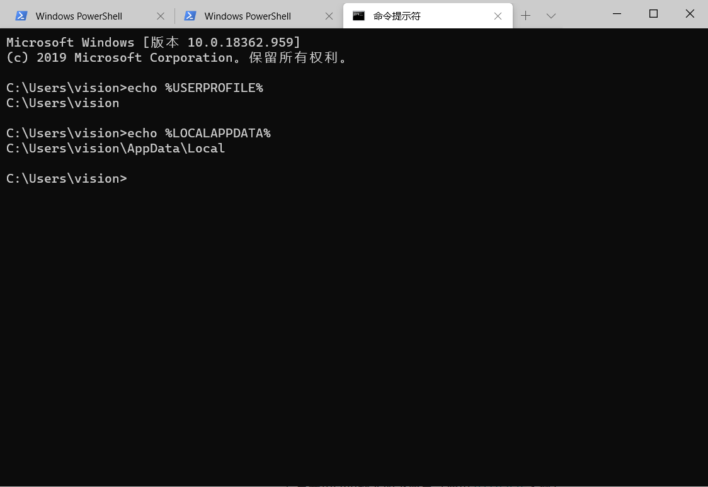

2. 获取图标：
   首先使用命令创建文件夹：

   ```shell
   mkdir "%USERPROFILE%\AppData\Local\Terminal"
   ```

   然后将文件同目录下的图标赋值到该文件夹下：

   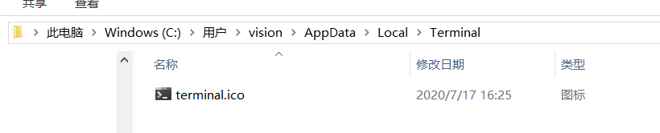

3. 添加注册表文件：
   使用文本编辑器写如下文字（注意对应修改），然后保存为`.reg`文件。

   ```shell
   Windows Registry Editor Version 5.00
   
   [HKEY_CLASSES_ROOT\Directory\Background\shell\wt]
   @="Windows Terminal here"
   "Icon"="%USERPROFILE%\\AppData\\Local\\Terminal\\terminal.ico"
   
   [HKEY_CLASSES_ROOT\Directory\Background\shell\wt\command]
   @="C:\\Users\\[你的电脑用户名！你的电脑用户名！]\\AppData\\Local\\Microsoft\\WindowsApps\\wt.exe"
   ```

4. 进一步完善：
   打开Windows Terminal的配置文件，然后找到 `startingDirectory`改为：`./` 即：`"startingDirectory": "./"`，就可以在打开的目录中打开Windows Terminal。


#### 3.11 VS的安装和卸载

##### 3.11.1 VS的安装

##### 3.11.2 VS的卸载

不要使用清理软件等软件卸载，需要进入控制面板中的卸载程序进行卸载。

在如下界面中，选择`Microsoft Visual Studio Installer`右键，选择`更改`，然后就在弹出的界面中进行卸载即可。

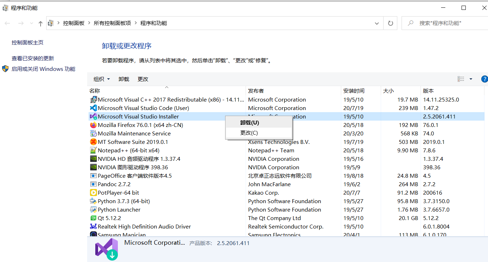

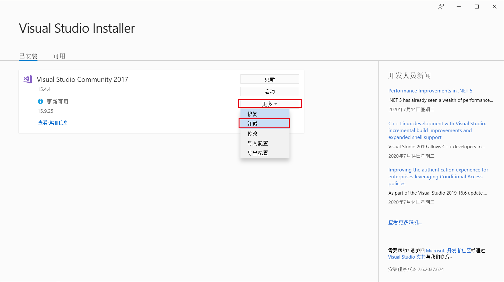

等待之后，发现卸载程序页面上还有如下类似的程序存在，可以直接卸载，也可留下。

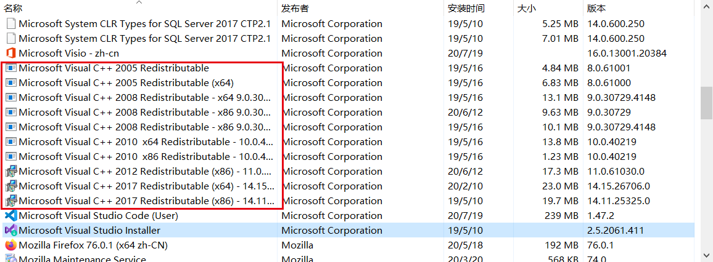


#### 3.12 安装ROS2

[参考网站](https://index.ros.org/doc/ros2/Installation/Foxy/Windows-Install-Binary/)

##### 3.12.1 安装Chocolatey

使用管理员权限打开CMD（虽然也可以使用PowerShell安装，但是太复杂，放弃），然后输入如下命令安装：

```shell
@"%SystemRoot%\System32\WindowsPowerShell\v1.0\powershell.exe" -NoProfile -InputFormat None -ExecutionPolicy Bypass -Command " [System.Net.ServicePointManager]::SecurityProtocol = 3072; iex ((New-Object System.Net.WebClient).DownloadString('https://chocolatey.org/install.ps1'))" && SET "PATH=%PATH%;%ALLUSERSPROFILE%\chocolatey\bin"
```


然后使用命令`choco -?`确认安装成功，会出现如下类似的显示（给出了部分，实际非常多）。

```shell
C:\Windows\system32>choco -?
This is a listing of all of the different things you can pass to choco.

Commands

 * list - lists remote or local packages
 * find - searches remote or local packages (alias for search)
 * search - searches remote or local packages (alias for list)
 * info - retrieves package information. Shorthand for choco search pkgname --exact --verbose
 * install - installs packages from various sources
 * pin - suppress upgrades for a package
 * outdated - retrieves packages that are outdated. Similar to upgrade all --noop
 * upgrade - upgrades packages from various sources
 * uninstall - uninstalls a package
 * pack - packages up a nuspec to a compiled nupkg
 * push - pushes a compiled nupkg
 * new - generates files necessary for a chocolatey package from a template
 * sources - view and configure default sources (alias for source)
 * source - view and configure default sources
 * config - Retrieve and configure config file settings
 * feature - view and configure choco features
 * features - view and configure choco features (alias for feature)
 * setapikey - retrieves, saves or deletes an apikey for a particular source (alias for apikey)
 * apikey - retrieves, saves or deletes an apikey for a particular source
 * unpackself - have chocolatey set itself up
 * version - [DEPRECATED] will be removed in v1 - use `choco outdated` or `cup <pkg|all> -whatif` instead
 * update - [DEPRECATED] RESERVED for future use (you are looking for upgrade, these are not the droids you are looking for)
```


##### 3.12.2 安装Python

使用如下命令利用Chocolatey安装Python

```shell
choco install -y python
```

安装最后会出现如下的显示：

```shell
Installed:
 - kb2919355 v1.0.20160915
 - python v3.8.4
 - kb3033929 v1.0.5
 - chocolatey-core.extension v1.3.5.1
 - kb2999226 v1.0.20181019
 - python3 v3.8.4
 - vcredist2015 v14.0.24215.20170201
 - kb2919442 v1.0.20160915
 - vcredist140 v14.26.28720.3
 - kb3035131 v1.0.3
 - chocolatey-windowsupdate.extension v1.0.4

Packages requiring reboot:
 - vcredist140 (exit code 3010)

The recent package changes indicate a reboot is necessary.
 Please reboot at your earliest convenience.
```

也就是此时要重启电脑。


##### 3.12.3 安装OpenSSL

[下载地址](https://slproweb.com/products/Win32OpenSSL.html)

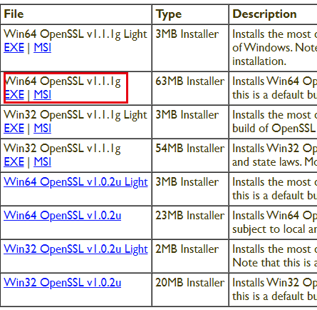

>  双击直接安装，选择将可执行文件放在`bin`目录下，不要放在系统的`System32`目录下！

```shell
setx -m OPENSSL_CONF "C:\Program Files\OpenSSL-Win64\bin\openssl.cfg"
```

然后将其放到系统环境变量中。


##### 3.12.4 下载安装opencv

[下载地址](https://github.com/ros2/ros2/releases/download/opencv-archives/opencv-3.4.6-vc16.VS2019.zip)

将其解压后放到`C:\opencv`目录下，然后在管理员权限下，在shell中执行命令：

```shell
setx -m OpenCV_DIR C:\opencv
```

并将路径加载到系统环境变量中：

`C:\opencv\x64\vc16\bin`


##### 3.12.5 其他依赖项

1. 安装CMake，并添加环境变量。
2. 安装一些包。

[下载地址](https://github.com/ros2/choco-packages/releases/latest)

需要下载如下文件：

- asio.1.12.1.nupkg
- bullet.2.89.0.nupkg
- cunit.2.1.3.nupkg
- eigen-3.3.4.nupkg
- tinyxml-usestl.2.6.2.nupkg
- tinyxml2.6.0.0.nupkg
- log4cxx.0.10.0.nupkg

以管理员身份打开shell，并执行如下命令：

```shell
choco install -y -s <PATH\TO\DOWNLOADS\> asio cunit eigen tinyxml-usestl tinyxml2 log4cxx bullet
```

将`<PATH\TO\DOWNLOADS>`更换为具体的下载文件夹。


3. 安装一些Python依赖

```shell
python -m pip install -U catkin_pkg cryptography empy ifcfg lark-parser lxml netifaces numpy opencv-python pyparsing pyyaml setuptools
python -m pip install -U pydot PyQt5
```

- 如果要使用`rqt_graph`命令，还需要安装[graphviz](https://graphviz.gitlab.io/_pages/Download/Download_windows.html)，然后将路径`C:\Program Files (x86)\Graphviz2.38\bin`添加到系统环境变量中。


##### 3.12.6 下载安装ROS2

[下载地址](https://github.com/ros2/ros2/releases)

下载release版本即可，如果想要Debug的库，则安装debug版本。

解压到`C:\dev\ros2_foxy`目录下即可。


##### 3.12.7 设置环境变量

执行如下命令：

```shell
call C:\dev\ros2_foxy\local_setup.bat
```

执行如上命令之后会报一个警告如下：

```shell
[connext_cmake_module] Warning: The location at which Connext was found when the workspace was built [[C:\Program Files\rti_connext_dds-5.3.1]] does not point to a valid directory, and the NDDSHOME environment variable has not been set. Support for Connext will not be available.
```

这是因为在安装中有一个可选步骤我们没有做，并不影响，如果需要可以按照教程安装。

> If you would like to use another DDS or RTPS vendor besides the default, eProsima’s Fast RTPS, you can find instructions [here](https://index.ros.org/doc/ros2/Installation/DDS-Implementations/).


##### 3.12.8 测试

**<u>不要使用管理员权限打开CMD！！！</u>**

打开两个CMD窗口，然后分别输入如下命令导入环境~

```shell
call C:\dev\ros2_foxy\local_setup.bat
```

然后在两个窗口中分别输入如下两条命令（一个talker，一个listener）：

```shell
ros2 run demo_nodes_cpp talker # 窗口1命令
ros2 run demo_nodes_py listener # 窗口2命令
```

则可以看到两个节点的通讯状态~


### 四、库安装和编程问题

#### 4.1 编码格式解决

gcc/g++编译的程序在power shell以及其他终端中中文显示乱码，是由于编码格式的问题，默认使用`UTF-8`，如果要在终端环境中正常显示中文，可以使用命令```g++ -fexec-charset=GBK main.cpp -o xxx.exe```。 

vs code中的可以直接解决，参考`vs code使用`文件。


#### 4.2 eigen安装

eigen[下载网站](http://eigen.tuxfamily.org/index.php?title=Main_Page)

下载之后，按照进行配置，但是在执行命令"make install"之前，要先设置路径（eigen库比较特殊，其他的库暂时没遇到）。

在cmake gui中已经完成操作之后，进入到编译文件所在位置，比如图中的"C:/eigen/eigen-build"，找到"Eigen3Config.cmake"文件，使用文本编辑器打开，修改第9行内容如下：

```cmake
get_filename_component(PACKAGE_PREFIX_DIR "C:/Program Files/Eigen3/" ABSOLUTE)
```

其中"C:/Program Files/Eigen3/"对应cmake gui界面配置图中蓝色框的内容。


#### 4.3 gflags安装

同4.2的操作打开cmake gui，在界面的基础上增加如下操作：

选中  BUILD_SHARED_LIBS

取消  BUILD_TESTING

CMAKE_INSTALL_PREFIX 值为：  C:/Program Files/gflags


然后依次点击configure和generate

通过终端软件（管理员权限打开），进入到build目录下执行

```shell
make install
```


#### 4.4 glog安装

安装了gflags之后才能安装glog。

同4.2的操作打开cmake gui，在界面的基础上增加如下操作：

选中  BUILD_SHARED_LIBS

取消  BUILD_TESTING

CMAKE_INSTALL_PREFIX 值为：  C:/Program Files/glog


然后依次点击configure和generate

通过终端软件（管理员权限打开），进入到build目录下执行

```shell
make install
```


#### 4.5 ceres安装

安装了eigen, gflags, glog之后才能安装ceres。

同4.2的操作打开cmake gui，在界面的基础上增加如下操作：

选中  BUILD_SHARED_LIBS

取消  BUILD_TESTING

取消  BUILD_EXAMPLES

CMAKE_INSTALL_PREFIX 值为：  C:/Program Files/Ceres

选中  EIGENSPARSE

选中  MINIGLOG

选中  GFLAGS


然后依次点击configure和generate

通过终端软件（管理员权限打开），进入到build目录下执行

```shell
make install
```
